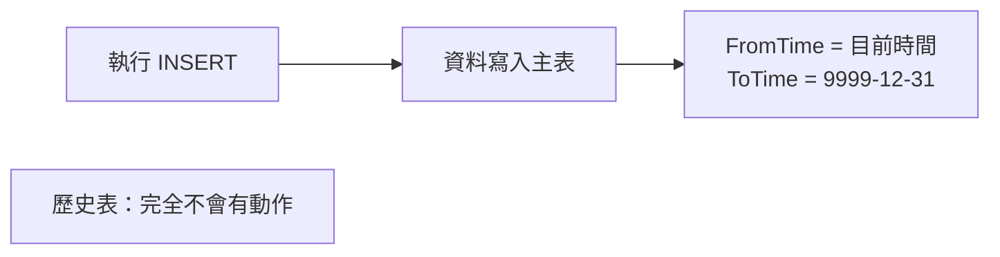
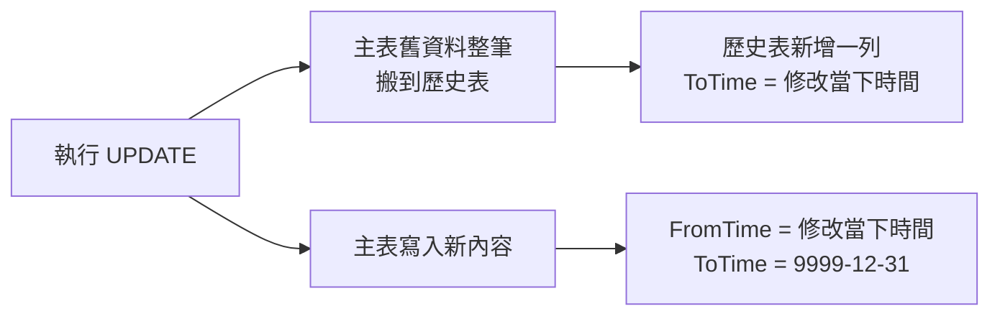
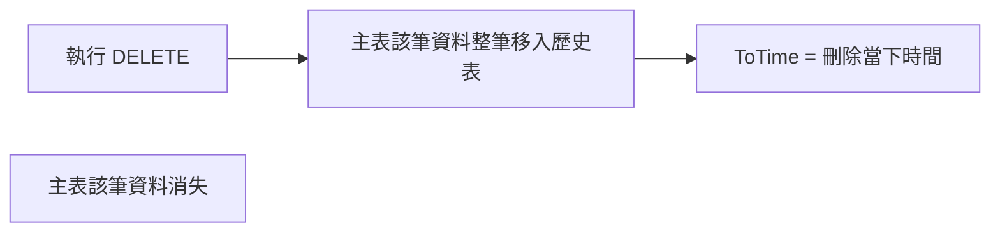

# Metadata
Status :: 🌱
Note Type :: 📰
Source URL :: {文章 URL}
Author :: {作者名稱}
Topics :: {筆記跟什麼主題有關，用 `[Topic],[Topic]` 格式}

---
# 連結筆記
#### 📑 [[SQL Server 時態表入門（二）：查詢技巧與五種 FOR SYSTEM_TIME 子句]]
#### 📑 [[SQL Server 時態表入門（三）：資料還原與維運]]

---
## 一、為什麼會有這個功能？先看實務痛點

在還沒有時態表之前，如果老闆或客服問你：

> 「上週五是誰把這筆訂單的狀態改掉的？」 「不小心刪錯資料了，能把設定還原到昨天的狀態嗎？」

我們的標準做法是自己寫一堆 Trigger（觸發器）📝，只要資料有更新，就手動複製一份塞進另一張 Log 表。這種做法有幾個明顯的問題：

- 難寫、難維護
- 容易拖慢效能
- 工程師其實可以直接竄改歷史紀錄，稽核公信力不足

SQL Server 2016 引入的**時態表**，就像資料庫內建的「自動存摺」或「時光機」⏳，把這件事直接交給資料庫引擎自動處理。

| 比較項目   | 傳統 Trigger 記錄歷史       | 時態表（Temporal Table）         |
| ------ | --------------------- | --------------------------- |
| 開發成本   | 高（需手寫 Trigger 判斷欄位變化） | 極低（建立 Table 時開啟版本設定即可）      |
| 查詢過去狀態 | 複雜（需自行 Join 或過濾時間區間）  | 簡單（內建 `FOR SYSTEM_TIME` 語法） |
| 防呆機制   | 工程師可輕易竄改歷史紀錄          | 預設禁止修改歷史表，具備稽核公信力           |
|        |                       |                             |

**一句話小結**：時態表把「維護資料變更履歷」的工作，從工程師手上交還給資料庫引擎自動處理。

---
## 二、時態表是什麼？

簡單講，它是 SQL Server 用來**自動記錄資料變更歷史**的機制：

- 修改或刪除資料時，舊的資料會自動被搬移到「歷史資料表」
- 可以隨時查詢「過去某個時間點」的資料狀態
- 非常適合用來做 Audit Log（稽核紀錄）

它由兩張表組成：

- **主表（Current Table）**：永遠只存放「最新」的現狀（就像存摺最後一筆餘額）
- **歷史表（History Table）**：系統自動在背景記錄所有過去發生過的變動明細

> 💡 這裡先劇透一個很多人會忽略的重點：**主表跟歷史表的欄位結構是完全一模一樣的**，我們在第二篇查詢的部分會解釋為什麼要這樣設計。

---
## 三、啟用時態表的 SQL 語法

啟用時態表分兩步驟：先加時間戳記欄位，再開啟版本控制。

### 第一步：修改資料表結構（加入時間戳記欄位）

```sql
ALTER TABLE [dbo].[GroupSetting] -- (改成要記錄的 Table 名稱)
ADD
  -- 1. 定義「開始時間」欄位
  FromTime DATETIME2(2) GENERATED ALWAYS AS ROW START -- HIDDEN (加入 HIDDEN，需指定欄位名稱(FromTime) 才會顯示)
        CONSTRAINT DF_GroupSetting_FromTime DEFAULT DATEADD(SECOND, -1, SYSUTCDATETIME()) NOT NULL,

  -- 2. 定義「結束時間」欄位
  ToTime DATETIME2(2) GENERATED ALWAYS AS ROW END -- HIDDEN (加入 HIDDEN，需指定欄位名稱(FromTime) 才會顯示)
        CONSTRAINT DF_GroupSetting_ToTime DEFAULT '9999.12.31 23:59:59.99' NOT NULL,

  -- 3. 定義這兩個欄位為「系統時間區間」
  PERIOD FOR SYSTEM_TIME (FromTime, ToTime);
GO
```

### 第二步：啟用版本控制

```sql
ALTER TABLE [dbo].[GroupSetting] -- (改成要記錄的 Table 名稱)
    SET (SYSTEM_VERSIONING = ON (HISTORY_TABLE = dbo.GroupSettingHistory));  -- (改成要記錄的「Table 名稱 + History」)
GO
```

就這樣，兩段 `ALTER TABLE` 執行完，這張表從此就有了「時光機」能力。

---
## 四、關鍵概念逐一拆解

### 1. 欄位說明
| 項目                           | 說明                            |
| ---------------------------- | ----------------------------- |
| **FromTime**                 | 欄位名稱（資料的生效時間）                 |
| **ToTime**                   | 欄位名稱（資料的失效時間）                 |
| **DF_GroupSetting_FromTime** | 約束條件（Constraint）名稱，**不是欄位名稱** |
| **DF_GroupSetting_ToTime**   | 約束條件（Constraint）名稱，**不是欄位名稱** |

> 🧭 常見誤區：一開始很容易把 `DF_GroupSetting_FromTime` 誤認為欄位，其實它只是約束條件的名字。給約束條件命名的好處是日後修改、刪除時比較方便找；如果不取名，系統會自動產生一串難記的亂數名稱。

### 2. 重要關鍵字

- **`DATETIME2(2)`**：精確度到小數點後兩位
- **`GENERATED ALWAYS AS ROW START`**：系統自動維護的「資料生效時間」（**不是** Insert 指令剛開始跑的時間）
- **`GENERATED ALWAYS AS ROW END`**：系統自動維護的「資料失效時間」（**不是** Insert 指令快跑完的時間）
- **`HIDDEN`**：加上此關鍵字後，`SELECT *` 時不會顯示這兩個時間欄位（建議使用）
    - 對於既有系統，強烈建議加上 `HIDDEN`，避免新增的兩個時間欄位導致程式的欄位對應錯誤，特別是使用 `SELECT *` 或 Dapper 等自動對應套件時，很容易因為多了兩欄而炸掉。
- **`SYSUTCDATETIME()`**：取得 UTC 時間 —— **時態表強制使用 UTC**，這點非常重要，我們在第二篇查詢時會反覆提醒。
- **`PERIOD FOR SYSTEM_TIME`**：告訴 SQL Server 這兩個欄位是用來計算資料有效存活期間的關鍵欄位。

### 3. 預設值的意義

**`FromTime` 的預設值**：`DATEADD(SECOND, -1, SYSUTCDATETIME())`

- 意義：現在的 UTC 時間減 1 秒
- 原因：確保既有資料在「啟用版本控制」的當下，狀態已經是「已生效」，不會卡在一個模糊的時間點
- 這個預設值只在 `ALTER TABLE` 當下影響既有資料，之後新增的資料會自動填入當下的實際時間

**`ToTime` 的預設值**：`'9999.12.31 23:59:59.99'`

- 意義：「直到永遠」（無限大）
- 原因：現行有效的資料還沒有「結束時間」
- 記住一個口訣：**只要看到 9999 年，就代表這是目前最新、有效的資料**

### 4. ROW START 與 ROW END 到底在講什麼

不是指 SQL 指令執行的「開始」與「結束」，而是指**資料的生命週期**：

- **ROW START（生效時間）**：這筆資料從什麼時候開始有效
- **ROW END（失效時間）**：這筆資料到什麼時候變成舊的、無效的

---
## 五、INSERT / UPDATE / DELETE 實際運作流程

理解了語法之後，最重要的是搞懂「資料異動時，主表跟歷史表分別會發生什麼事」。

### INSERT（新增）



**答案是：新增不會寫入歷史表。**

想像主表跟歷史表的關係是「銀行帳戶的現在餘額」與「過去的交易明細」🏦。歷史表的設計目的是專門存放「已經成為過去式」的舊資料。當你 `INSERT` 一筆全新資料時，它只有「現在」，還沒有任何「過去」，所以只會寫入主表，歷史表這階段完全不會動。

### UPDATE（修改）



1. 舊資料複製到歷史表：`FromTime` = 原本時間、`ToTime` = 修改當下的時間
2. 主表資料被更新：`FromTime` = 修改當下的時間、`ToTime` = 9999/12/31

> ⚠️ **常見踩坑（非常重要）**：SQL Server 引擎認的是「動作（DML 指令）」，而不是「內容差異」。也就是說，**即使 `UPDATE` 完全沒有改變任何數值，SQL Server 依然會把當下的紀錄整筆寫入歷史表**。
> 
> 如果你的程式習慣做「盲目更新」（例如整包表單資料直接送回資料庫 `UPDATE` 全欄位，不管有沒有真的改動），歷史表會迅速膨脹，塞滿一堆數值一模一樣的垃圾紀錄。
> 
> 時態表很適合用來做高價值的稽核追蹤，但如果是那種「每秒都在更新、且經常覆寫同樣數值」的高頻狀態表，就不適合套用時態表。

### DELETE（刪除）



### 時間欄位怎麼產生的？

`FromTime` / `ToTime` 這兩個欄位由系統底層嚴格管控，開發者**無法也無權**在新增或更新時手動指定它們的值。而且用的是**「該次修改所屬交易（Transaction）開始時的 UTC 時間」**。

🧠 **背後的設計巧思**：如果你在同一個 Transaction 裡同時更新了 1 萬筆資料，這 1 萬筆歷史紀錄的時間標記會**一秒不差地完全相同**。這確保了未來做跨表「時間點還原」時，資料邏輯絕對一致。

### 主表與歷史表：完美互斥的雙胞胎

- 兩張表的**欄位結構完全一模一樣**（包含 `FromTime`、`ToTime`）
- 相同一筆資料的「同一個狀態」，**絕對不會**同時出現在兩張表中，兩者是互斥的

用一筆訂單（ID=1）的生命週期來看會更清楚：

|發生動作|誰在主表（現役選手）🏃|誰在歷史表（退役選手）🪑|
|---|---|---|
|1. 新增（Insert）訂單狀態：`處理中`|ID=1, `處理中`（Time: 當下 ~ 9999年底）|（無資料）|
|2. 修改（Update）訂單狀態：`已出貨`|ID=1, `已出貨`（Time: 修改當下 ~ 9999年底）|ID=1, `處理中`（Time: 新增當下 ~ 修改當下）|
|3. 刪除（Delete）訂單|（無資料，主表清空）|ID=1, `處理中`（舊）+ ID=1, `已出貨`（Time: 修改當下 ~ 刪除當下）|

主表資料的 `ToTime` 永遠是 `9999-12-31`（代表持續有效）。一旦它的生命結束（被改掉或刪除），`ToTime` 就會被押上當下時間，並被踢進歷史表。所以**現狀絕對不會出現在歷史表中**。

---
## 六、如何防範「沒變更卻產生無意義歷史紀錄」

既然我們已經知道「即使資料沒變，執行 UPDATE 還是會產生歷史紀錄」，實務上要防範歷史表被灌爆，通常會佈署兩道防線：

### 第一道防線：應用程式層（C#）

如果你使用 Entity Framework Core（EF Core）這樣的 ORM，它內建了「變更追蹤（Change Tracker）」機制：從資料庫讀出一筆資料後，若儲存時屬性值跟剛讀出來時完全一樣，EF Core 根本**不會發送 `UPDATE` 指令**，直接從源頭解決問題。

### 第二道防線：資料庫層（SQL 語法）

如果是自己手寫 SQL（例如用 Dapper 或 ADO.NET），可以用 `WHERE` 條件做最後把關，明確要求「只有新舊值不一樣時才更新」：

```sql
UPDATE Users
SET Email = @NewEmail
WHERE ID = @UserID
  AND Email <> @NewEmail; -- 關鍵防線：信箱真的有改才更新
```

### 兩道防線對比

|防線位置|實作方式|優點|缺點 / 踩坑點|
|---|---|---|---|
|應用程式（C#）|依賴 EF Core 的 Change Tracker|程式碼乾淨，完全不消耗資料庫資源|⚠️ 若用純 Dapper 將整包物件直接 Update，會失去此保護，歷史表暴增|
|資料庫（SQL）|`UPDATE` 加入 `WHERE 欄位 <> 新值`|絕對安全，不受前端或程式邏輯漏洞影響|欄位很多時，SQL 語法會變得很冗長|

> 📝 小結：防範歷史表暴增的最佳實務，是利用 EF Core 的追蹤機制不發送廢指令，或在手寫 SQL 時加上差異判斷。