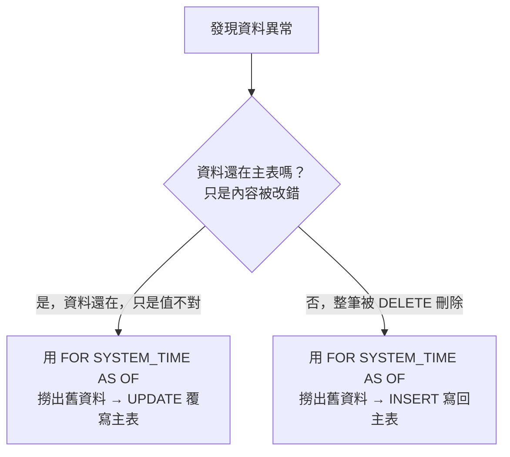

# Metadata
Status :: 🌱
Note Type :: 📰
Source URL :: {文章 URL}
Author :: {作者名稱}
Topics :: {筆記跟什麼主題有關，用 `[Topic],[Topic]` 格式}

---
# 連結筆記
#### 📑 [[SQL Server 時態表入門（一）：基礎觀念與建立語法]]
#### 📑 [[SQL Server 時態表入門（二）：查詢技巧與五種 FOR SYSTEM_TIME 子句]]

---
## 一、時態表沒有「魔法復原（Undo）按鈕」

這是一個非常重要的觀念：**歷史表是「唯讀的鐵證」**，用來做稽核用的，資料庫不准你把歷史資料直接「搬」回主表。

> 📄 **日常比喻**：想像你在寫 Word 文件，不小心刪了一段。你的做法不是去修改「檔案總管裡的歷史紀錄」，而是打開「歷史版本」，把舊文字**複製**起來，**貼上**到你現在的文件裡。

所以，所謂的「還原」，其實就是「**查出舊資料，然後拿它來對現在的主表發動一次新的操作**」。依照資料現在的狀態不同，做法分兩種。



### 情境一：資料被改錯，用 UPDATE 覆寫

```sql
-- 做法：把昨天下午 3 點的舊資料撈出來，直接更新覆寫現在的主表
UPDATE CurrentTable
SET Status = OldData.Status,
    Amount = OldData.Amount -- 假設你要還原這兩個欄位
FROM Orders AS CurrentTable
INNER JOIN (
    -- 這就是去調閱昨天的「舊照片」
    SELECT ID, Status, Amount
    FROM Orders FOR SYSTEM_TIME AS OF '2026-08-20 07:00:00'
    WHERE ID = 1
) AS OldData ON CurrentTable.ID = OldData.ID;
```

執行這段 `UPDATE` 後，系統會把資料變回昨天的樣子。而且時態表會忠實記錄：「在今天這個時刻，有人把資料改回了昨天的狀態」，完美保留稽核軌跡。

### 情境二：資料整批被 DELETE，用 INSERT 重建

主表已經沒有紀錄可以更新了，只能用 `INSERT` 把舊資料重新寫回去：

```sql
-- 將案發前的舊資料，重新新增回主表
INSERT INTO Orders (ID, Status, Amount)
SELECT ID, Status, Amount
FROM Orders FOR SYSTEM_TIME AS OF '2026-08-20 07:00:00'
WHERE ID = 1; -- 或是針對大批被刪除的資料下條件
```

> ⚠️ **觀念釐清**：雖然塞回主表的是「昨天的舊內容」，但對時態表機制來說，這是一批「現在才誕生」的新紀錄。因此這批重生資料的 `FromTime` 會被系統自動押上**執行還原當下的時間**，完全不需要（也不允許）手動把昨天的時間寫進去。這再次呼應時態表的鐵則：**歷史時間線必須絕對連續，不容竄改。**

### 💣 最危險的踩坑：千萬不要關閉版本控制手動搬資料

網路上可能會看到有人教你：_先執行 `ALTER TABLE ... SET (SYSTEM_VERSIONING = OFF)` 把時光機關掉，然後手動把歷史表的資料搬回來，最後再打開時光機。_

**拜託絕對不要這麼做！** 除非是整個資料庫災難崩潰，否則這會把連續的稽核時間線弄斷。如果系統有受法規稽核（例如公司內部某些財報系統），關閉歷史表可能會帶來嚴重的資安合規問題。**乖乖用 `UPDATE` / `INSERT` 覆寫才是王道。**

> 📝 小結：發現資料**改錯**時，用舊紀錄來 `UPDATE` 覆寫；發現資料**刪錯**時，用舊紀錄來 `INSERT` 重建。這就是時態表災難救援的兩大核心招式。

---
## 二、修改主表結構，歷史表會自動同步嗎？

⚙️ **會，而且是自動同步。**

時態表的主表跟歷史表就像是「本體與影子」的關係。當你對主表執行 `ALTER TABLE`（例如新增或刪除一個欄位），SQL Server 會在底層自動幫你把歷史表也做一模一樣的修改。

背後原因：資料庫在查詢舊資料時，必須把兩張表拼湊起來（`UNION ALL`）。如果兩邊欄位數量或型態不一致，系統就會報錯。為了防止這種人為失誤，SQL Server 強制接管了歷史表的結構變更，不讓你手動去改歷史表結構。

---
## 三、效能維運：歷史表資料量爆炸怎麼辦？

隨著系統上線時間越長，歷史表的資料量可能膨脹到非常龐大。單靠精準的 `WHERE` 條件是不夠的——假設歷史表已經累積 5,000 萬筆紀錄，就像一個塞滿 5,000 萬張舊單據的超級大倉庫。即使你明確告訴守衛（資料庫引擎）「我要找訂單編號 1 號」，如果守衛不知道單據放在哪，還是得把 5,000 萬張單據從頭翻到尾（全資料表掃描）。

實務上要搭配兩大機制作為防線：

### 1. 為歷史表建立專屬的索引（Index）

這就像幫倉庫建立一份目錄指引。

- **內建機制**：啟用時態表時，SQL Server 預設會幫歷史表的兩個時間欄位（`FromTime`、`ToTime`）建立叢集索引（Clustered Index），讓 `FOR SYSTEM_TIME` 的時間區間篩選很快。
- **常見踩坑 🧨**：很多工程師主表有建 `ID` 的索引，卻忘記**歷史表是一張獨立的表，不會繼承主表的非叢集索引**！如果經常需要用 `WHERE ID = ...` 查歷史表，必須「手動」在歷史表針對 `ID` 欄位建立非叢集索引（Non-Clustered Index）。沒做這件事，是時態表效能變差的頭號元兇。

### 2. 設定歷史資料保留原則（Retention Policy）

這就像規定「倉庫只保留最近 1 年的單據，超過的就放進碎紙機自動銷毀」。

- 在 SQL Server 2017 之後，微軟加入了 `HISTORY_RETENTION_PERIOD` 功能，可以在建立或修改時態表時設定，例如 `HISTORY_RETENTION_PERIOD = 6 MONTHS`。
- 資料庫底層會有背景排程，默默幫你把超過半年的歷史資料清掉，從根本上控制歷史表體積，完全不用自己寫排程刪資料。

### 兩大防線收斂對比

| 解決方案            | 作用機制   | 實務比喻                  | 適用情境                         |
| --------------- | ------ | --------------------- | ---------------------------- |
| 加建索引（Index）     | 加速搜尋速度 | 幫歷史倉庫建立「依訂單編號查詢」的目錄   | 經常需要針對特定條件（如 ID、會員帳號）調閱歷史紀錄時 |
| 保留原則（Retention） | 控制總資料量 | 買一台自動碎紙機，定時銷毀過期太久的舊單據 | 法規或業務上只需追溯特定期間（如半年內）的變更紀錄時   |

> 📝 小結：要讓時態表查詢跑得快，除了下精準的 `WHERE` 條件，還要記得「幫歷史表建索引」以及「設定資料保留期限」，雙管齊下。

---
## 四、延伸思考：EF Core 對時態表的支援

EF Core 從 6.0 開始已原生支援 SQL Server 時態表，能用 LINQ 寫出對應 `AS OF` / `FROM...TO` 的歷史查詢語法，若你日後要在 GamingPortal（.NET 8.0 + EF Core 8.0.22）專案中查詢時態表，可以留意 EF Core 官方文件中 Temporal Tables 相關的查詢 API。