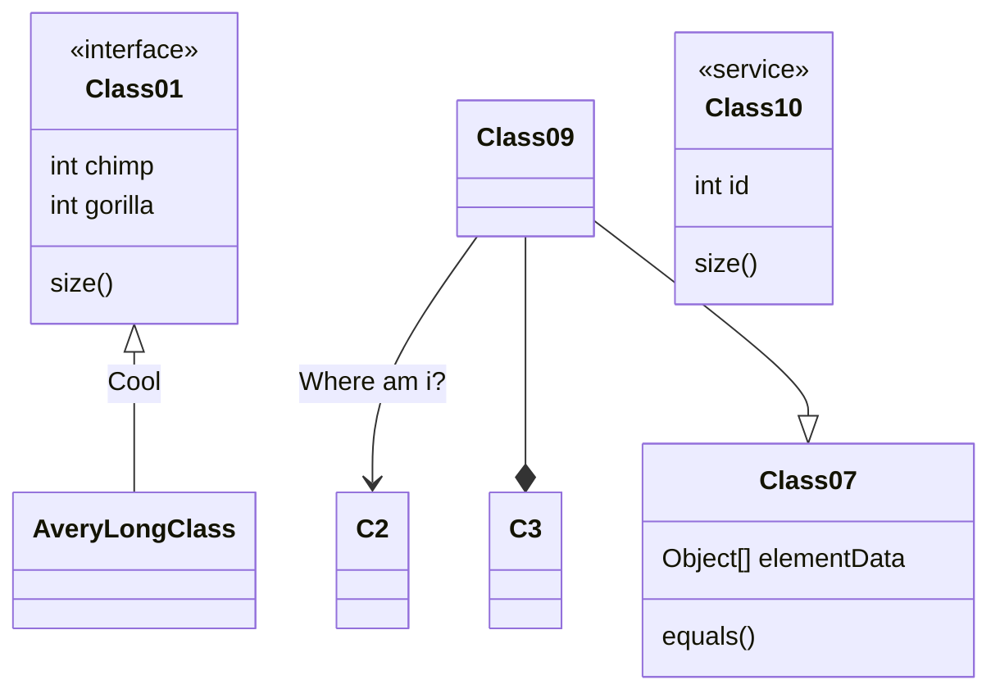
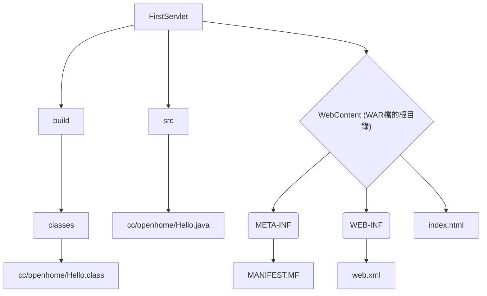

# chunko2x 測試筆記

## [連結其他文章](/5oFSv37AQ7u4PLp9ZTAkZw?bothe)


> 作者：cko2x
> 審閱人：陶亦白
> 發行人：銳悌科技


display
====

display2
---


## 1.芭樂多少錢
去問店員啊

---

- 系統代號：ITAAXM
- 系統名稱：1. FXML財金公司通訊系統
- 系統代號：*ITAAED*
- 系統名稱：**FEDI財金公司通訊系統**
- 系統代號：ITAARA
- 系統名稱：[RA/FXML憑證管理系統](https:// "title")
- 系統代號：DCUAYM
- 系統名稱：全球金融網(GEB)


## 貼上程式碼
```sql=
-- 依放行時間排序 --
select 
	case when vu.CustPermId is not null then 'true' else '' end as PayerIsVIP,
    tl.PackageId, tl.PmtId, tl.PrcDt as 覆核放行時間, tl.Type, tl.StatusCode, tl.FxmlCode, tl.HostCode,
    pl.SettlementId, pl.RemitType, pl.RunDt as 執行匯款時間, pl.Memo,
    pyr.LegalName as 付款人, pyr.CustPermId as 付款人統編, pyr.AcctId as 付款帳號, pyr.CurAmt as 付款金額, pyr.PrcDt as 付款日期,
    pye.LegalName as 收款人, pye.CustPermId as 收款人統編, pye.AcctId as 收款帳號, pye.ContactData as Email
from transaction_log as tl
    left join Payment_log as pl on tl.PmtId = pl.PmtId
    left join Payer_log as pyr on tl.PmtId = pyr.PmtId
    left join Payee_log as pye on tl.PmtId = pye.PmtId
    left join VIP_USER as vu on pyr.CustPermId = vu.CustPermId
where 1=1 
    --and tl.PmtId='12206080000818'
    and tl.PackageId in (select PackageId from ScheduledPlan where RunDt='2022-06-09')
order by tl.PrcDt desc
```

---

* 1111
* 3546

1. 123
1. 456
1. 789


`ckowx is me `

```
程式區塊
```

> ddd
> 
> [name=chunko2x] [time=Mon, Aug 8, 2022 7:08 PM]
> [color=#d37a5f]

---

![image alt][reference]


==11111==

:arrow_right: 箭頭箭頭 :arrow_left:

:tada:

<i class="fa fa-pencil fa-fw"></i> Edit: See only the editor.
<i class="fa fa-eye fa-fw"></i> View: See only the result.
<i class="fa fa-columns fa-fw"></i> Both: See both in split view.


:::spoiler
ddddd
:::

<iframe width="100%" height="500" src="https://hackmd.io/features" frameborder="0"></iframe>

圖案
https://gist.github.com/rxaviers/7360908

檢視
===
## 目錄

## ToC:

[TOC]

- [ ] item1
- [ ] item2
- [ ] item3
- [ ] item4
```vb=
function Average(score as integer) as integer
    
end function
```


```javascript=53
var s = "JavaScript syntax highlighting";
alert(s);
function $initHighlight(block, cls) {
  try {
    if (cls.search(/\bno\-highlight\b/) != -1)
      return process(block, true, 0x0F) + 
             ' class=""';
  } catch (e) {
    /* handle exception */
  }
  for (var i = 0 / 2; i < classes.length; i++) {
    if (checkCondition(classes[i]) === undefined)
      return /\d+[\s/]/g;
  }
}
```


> 789
> [color=#a53a22]
> > 123
> > [color=#d37a5f]

```sequence
林子鈞->林明賢:Hello，媽媽有在你那邊嗎？

```

19^th^
H~2~O

* 1111
* * 2222
* * * 333

+ 在行開頭使用 `+` `-` 或是 `*` 來建立清單
+ 空兩個空白就可以產生子清單
    - 當清單標記使用的字元不同，會強制建立新的清單
        * Ac tristique libero volutpat at
        + Facilisis in pretium nisl aliquet
        - Nulla volutpat aliquam velit
+ 非常簡單！


| Column 1 | Column 2 | Column 3 |
| --- | -------- | -------- |
| Text     | Text     | Text     |
| 748<br>1111 | 3333 | 111 |
| -------- | -------- | -------- |

### 定義清單
名詞 1
: 定義1
: 定義 2

{這些程式碼屬於 定義 2 的一部分}

### h3

註腳 1 連結[^first].
註腳 2 連結[^second].
行內註腳^[行內註腳的文字] 定義
重複的註腳參考[^second].

[^first]: 註腳 **也可以標記**
    還可以有很多段落
[^second]: 註腳 文字


```csvpreview
ming
ckowx
wen
justin
```

-[大家好，這次要來介紹生產力的工具Mermaid](https://ithelp.ithome.com.tw/articles/10234553)
-[State diagrams](https://mermaid.js.org/syntax/stateDiagram.html)



