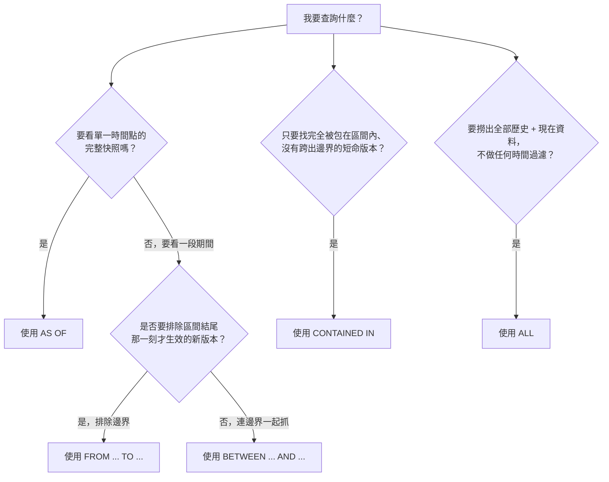

# Metadata
Status :: 🌱
Note Type :: 📰
Source URL :: {文章 URL}
Author :: {作者名稱}
Topics :: {筆記跟什麼主題有關，用 `[Topic],[Topic]` 格式}

---
# 連結筆記
#### 📑 [[SQL Server 時態表入門（一）：基礎觀念與建立語法]]

---
## 一、查詢前的核心觀念：強制使用 UTC

時態表內部儲存的時間，**強制使用 UTC 時間**，這是設計規則，無法改變。台灣是 UTC+8，也就是說在台灣查詢資料時，你會發現時間少了 8 小時。

> ⚠️ **踩坑經驗**：實務上千萬不要試圖把台灣時間直接寫進時態表；只要在查詢出來、呈現給使用者之前，再轉回本地時間（Local Time）即可。原因是避免日光節約時間或時區變更造成時間錯亂。

---
## 二、查詢所有資料（現行 + 歷史）：`FOR SYSTEM_TIME ALL`

```sql
SELECT
    -- UTC 轉台北時間
    CAST(FromTime AT TIME ZONE 'UTC' AT TIME ZONE 'Taipei Standard Time' AS DATETIME) AS FromTime_TW,

    -- UTC 轉台北時間（包含溢位保護）
    CASE
        WHEN ToTime < '9999-01-01'
        THEN CAST(ToTime AT TIME ZONE 'UTC' AT TIME ZONE 'Taipei Standard Time' AS DATETIME)
        ELSE ToTime
    END AS ToTime_TW,

* FROM [dbo].[GroupSetting] FOR SYSTEM_TIME ALL
WHERE Id = 286
ORDER BY FromTime DESC;
```

**重點：**

- `FOR SYSTEM_TIME ALL` 會自動 `UNION` 主表與歷史表
- **必須**處理 9999 年的溢位問題，因為 `9999-12-31` 不能直接加 8 小時（會超出 `datetime` 的可表示範圍），一定要用 `CASE WHEN` 判斷是否為歷史資料再轉換

---

## 三、查詢某個時間點的快照：`FOR SYSTEM_TIME AS OF`

```sql
-- 宣告變數：1 小時前的 UTC 時間
DECLARE @OneHourAgo DATETIME2 = DATEADD(hour, -1, SYSUTCDATETIME());

SELECT
    CAST(FromTime AT TIME ZONE 'UTC' AT TIME ZONE 'Taipei Standard Time' AS DATETIME) AS FromTime_TW,
    CASE
        WHEN ToTime < '9999-01-01'
        THEN CAST(ToTime AT TIME ZONE 'UTC' AT TIME ZONE 'Taipei Standard Time' AS DATETIME)
        ELSE ToTime
    END AS ToTime_TW,

* FROM [dbo].[GroupSetting] FOR SYSTEM_TIME AS OF @OneHourAgo
WHERE Id = 286;
```

你可以把 `AS OF` 想像成一台**時光照相機** 📸，按下快門那一刻，拍下的是「整張資料表在那個瞬間的全貌」。

幾個常見疑問，一次釐清：

**1. 真的精準到零分零秒嗎？** 是的，而且比這更精準。時態表底層使用 `datetime2`，預設精準度可達小數點後 7 位（100 奈秒）。輸入 `07:00:00` 時，資料庫實際上當作 `07:00:00.0000000` 來比對——如果有一筆資料剛好在 `07:00:00.0000001` 才被修改，就不算在 7 點整那個切面裡。

**2. 會抓單筆還是多筆？** 會抓出「所有」符合條件的資料。如果沒加 `WHERE ID = ...`，它會把那個時間點所有還活著（有效）的資料全部撈出來。

---

## 四、時態表時間過濾，到底比對的是哪個欄位？

很多剛接觸時態表的人（這是常見踩坑點 🧨）會以為它跟平常寫 `WHERE CreateTime = '2026-08-20'` 一樣，是去對齊「單一日期欄位」。

但其實，時態表的時間過濾，是**同時針對 `FromTime` 與 `ToTime` 兩個欄位一起做綜合比對**的。

> 🏨 **日常比喻**：把歷史表裡的每一筆資料想像成「入住飯店的房客」。`FromTime` 是 Check-in（入住）時間，`ToTime` 是 Check-out（退房）時間。當你下 `AS OF '下午 3 點'`，你問的不是「誰剛好在下午 3 點 Check-in」，而是「下午 3 點這個時刻，**誰『正在』房間裡面**」。

底層邏輯展開：`FOR SYSTEM_TIME AS OF '2026-08-20 15:00:00'` 實際上會轉譯成：

```
找出所有 FromTime <= 下午3點 而且 ToTime > 下午3點 的資料
```

它看的是這筆資料的「存活區間」有沒有包含你指定的那個時間點。

> 📝 **補充**：由於建表時用 `GENERATED ALWAYS AS ROW START/END` 標註了欄位，SQL Server 底層的 Metadata 系統已經牢牢記住這兩個欄位的特殊身份，查詢時會自動鎖定它們，即使你把欄位取名為 `ValidFrom` / `ValidTo` 也不需要手動指定。

---
## 五、查詢一段時間區間

當你只用 `AS OF`，看到的是「案發瞬間的照片」。但如果客戶抱怨「我下午 3 點到 3 點 25 分之間，一直狂按修改按鈕都失敗！」，這時候你需要的是一段「監視器錄影畫面」，把這段時間內所有變更過程都拉出來看。

SQL Server 提供三種區間查詢語法，差別在於「有沒有包含頭尾的邊界點」：

| 語法指令                                        | 邊界條件    | 什麼時候該用？                                 |
| ------------------------------------------- | ------- | --------------------------------------- |
| `FOR SYSTEM_TIME FROM '開始' TO '結束'`         | 包頭，不包尾  | 最常用！查詢「從某個整點到另一個整點之間」，不會不小心把下一個時段的起點算進來 |
| `FOR SYSTEM_TIME BETWEEN '開始' AND '結束'`     | 包頭，包尾   | 需要明確指定到毫秒，且起迄時間點都要涵蓋時使用                 |
| `FOR SYSTEM_TIME CONTAINED IN ('開始', '結束')` | 嚴格包在區間內 | 只查「這段時間內才出現，且這段時間內就消滅」的短命紀錄             |

```sql
-- 調閱這 25 分鐘內的變更「錄影帶」（記得先轉 UTC）
SELECT *
FROM Orders
FOR SYSTEM_TIME FROM '2026-08-20 07:00:00' TO '2026-08-20 07:25:00'
WHERE ID = 1;
```

> 📝 小結：`AS OF` 是看靜態照片，`FROM ... TO ...` 是調閱動態錄影帶，記得根據要不要「包含邊界」來挑選指令。

### 精確版的「包頭 / 包尾」說法

所以「包頭，不包尾」跟「包頭，包尾」這兩句話，精確一點應該這樣理解：

> **`FROM...TO` 包頭，不包尾** —— 在 `@start` 誕生的版本算（包頭）；但「剛好在 `@end` 誕生」的新版本不算（不包尾）。
> **`BETWEEN...AND` 包頭又包尾** —— 在 `@start` 誕生的版本算（包頭，跟上面一樣）；「剛好在 `@end` 誕生」的新版本也算（包尾）。

「在 `@end` 死亡」的資料，兩個子句其實**都會撈出來**，不是差異點，千萬別跟「在 `@end` 誕生」搞混了。

### 簡單記法：一句話 + 區間直覺

不用硬背四種情境，記住這一句就夠了：`

> **A 這端，兩個子句永遠一樣：只要那筆資料在 `@start` 這個時間點「還活著」，就算。**
> **B 這端，才是兩者唯一的差別：`FROM...TO` 不把「剛好在 `@end` 誕生的新版本」算進去；`BETWEEN...AND` 會多算這一種。**

### 選哪個的判斷口訣
- 不確定選哪個、想保守一點、**不要漏資料** → 選 `BETWEEN...AND`（多收一種邊界情況，比較不會漏掉稽核紀錄）
- 需要**精準切段**、做連續報表區間（例如每月一段、避免月底交界重複計算）→ 選 `FROM...TO` 

---
## 六、核心觀念釐清：重疊邏輯 vs 完全包含邏輯

這是整份資料裡最容易搞混、也最值得花時間搞懂的一段。我們先看底層轉譯：

| 子句                            | 底層轉譯條件                                  | 邏輯意圖                                          |
| ----------------------------- | --------------------------------------- | --------------------------------------------- |
| `FROM @start TO @end`         | `FromTime < @end AND ToTime > @start`   | 版本在這段期間內**曾經有效過（重疊）**，不包含剛好壓線在 `@end` 才生效的新版本 |
| `BETWEEN @start AND @end`     | `FromTime <= @end AND ToTime > @start`  | 同上，但**包含**剛好在 `@end` 生效的版本                    |
| `CONTAINED IN (@start, @end)` | `FromTime >= @start AND ToTime <= @end` | 版本的**生效起訖都完全落在**區間內                           |

### 為什麼 FROM/TO、BETWEEN/AND 用的是「重疊」邏輯？

很直覺會以為應該寫成 `@start <= FromTime AND ToTime < @end`——但這其實是 **`CONTAINED IN`** 的邏輯，不是 `FROM...TO` / `BETWEEN...AND` 的！

`FROM...TO` 與 `BETWEEN...AND` 的設計目的是：**只要這個版本在查詢區間內「曾經生效過一部分」，就要撈出來**，不管它的起訖時間有沒有超出區間邊界。用時間軸攤開來看最清楚：

```mermaid
%%{init: {
  "theme": "base",
  "themeVariables": {
    "background": "#1a1a1a",
    "primaryColor": "#FAEEDA",
    "primaryBorderColor": "#FAC775",
    "primaryTextColor": "#3d3d3a",
    "taskBkgColor": "#FAEEDA",
    "taskBorderColor": "#FAC775",
    "taskTextColor": "#3d3d3a",
    "taskTextOutsideColor": "#c2c0b6",
    "activeTaskBkgColor": "#FAEEDA",
    "activeTaskBorderColor": "#FAC775",
    "sectionBkgColor": "#2a2a2a",
    "altSectionBkgColor": "#1a1a1a",
    "gridColor": "#555555",
    "lineColor": "#666666",
    "todayLineColor": "#e24b4a"
  },
  "gantt": {
    "leftPadding": 400,
    "rightPadding": 20
  }
}}%%
gantt
    dateFormat HH:mm
    axisFormat %H:%M
    section 查詢區間
    @start ~ @end :active, q1, 08:00, 16:00
    section 版本A 跨進來 ← 起點在區間外、結束在內，算重疊
    FromTime ~ ToTime :a1, 06:00, 11:00
    section 版本B 跨出去 ← 起點在區間內、結束在外，算重疊
    FromTime ~ ToTime :b1, 13:00, 18:00
    section 版本C 整個包住 ← 起訖都跨出區間，算重疊
    FromTime ~ ToTime :c1, 07:00, 17:00
    section 版本D 完全被包住 ← 只有這種，CONTAINED IN 才會抓
    FromTime ~ ToTime :d1, 09:00, 15:00
```



判斷「兩個區間是否重疊」的標準寫法是：

> **A 的開始 < B 的結束 且 B 的開始 < A 的結束**

套進來就是 `FromTime < @end AND ToTime > @start`——這是 A、B、C、D 四種情況通通會抓到；而 `CONTAINED IN` 的寫法 `FromTime >= @start AND ToTime <= @end` 則只會抓到 D。

> 🧨 **常見踩坑**：一般 T-SQL 的 `WHERE Col BETWEEN X AND Y` 相當於 `>= X AND <= Y`（兩端都包含）。但在時態表中，`FOR SYSTEM_TIME BETWEEN X AND Y` 的底層邏輯完全不同（是重疊判斷，不是單欄位範圍判斷）。很多人會誤把它當成一般 SQL 的 `BETWEEN` 來理解，結果撈出超乎預期的資料。

---
## 七、我該用哪一個語法？決策流程



實務判斷原則：

- **`AS OF`**：只想看「某一個特定時間點（例如昨天下午三點整）」長怎樣時用，不要用區間查詢，否則效能和結果都會變複雜。
- **`FROM...TO`**：需要嚴格切割時間區段、做「連續計費週期」或「報表分段統計」時，可避免相鄰區間交界處資料被重複計算。
- **`BETWEEN...AND`**：做稽核追蹤（Audit Trail）或歷史鑑識，希望這段時間內「曾經存在或剛好交接」的歷程全部被納入、一個不漏時使用。

---

## 八、底層都會先合併兩張表嗎？

是的。不論用哪一種時間條件，資料庫引擎的標準動作都是：

1. 將主表（現在）與歷史表（過去）做 `UNION ALL` 邏輯合併
2. 根據下的時間範圍，過濾 `FromTime` 和 `ToTime`
3. 再套用你的 `WHERE` 條件（例如特定 ID）

五種子句快速收斂：

|時間語法|核心用途（比喻）|底層邏輯|
|---|---|---|
|`ALL`|完整履歷表（不分時間全撈）|直接合併主表與歷史表，不套用任何時間過濾|
|`AS OF`|靜態照片（看某個瞬間的全貌）|找 `指定時間` 落在 `FromTime` ~ `ToTime` 之間的資料|
|`FROM...TO`|監視器錄影（看一段期間的變化，不含結尾）|找與 `指定區間` **重疊**的所有歷史紀錄|
|`BETWEEN...AND`|監視器錄影（含結尾）|同上，但含上邊界|
|`CONTAINED IN`|只找完全落在區間內的短命紀錄|找 `FromTime` ~ `ToTime` **完全被包住**的紀錄|