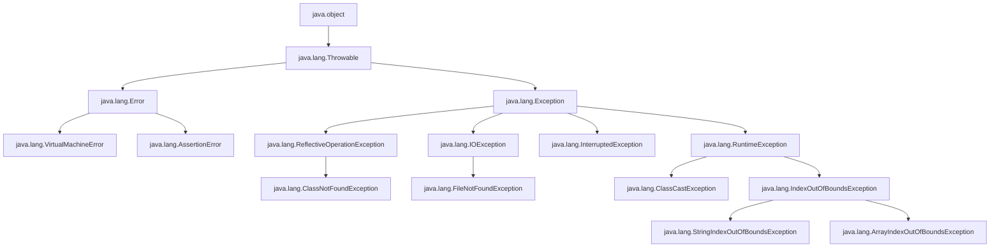

# Java SE17 技術手冊 CH01 ~ CH10
###### tags: `書籍筆記`

---

## Eclipse 快速鍵

- [eclipse程式碼摺疊/展開之筆記本快捷鍵設定 - 程式人生 (796t.com)](https://www.796t.com/content/1550391150.html)

---

## 第4章 認識物件

為了節省記憶體，在 new String() 時，如果 String Pool 有相同的字串內容，則直接指向該 References

運算子 ==，用於基本型態，是比較兩個變數儲存的值是否相同
運算子 ==，用於類別型態，是比較兩邊的運算元，是否為同一物件

```java=
// Object.equals() 是比較兩邊的物件，是否為同一物件
public boolean Object.equals(Object obj){
	return this == obj;
}

String.equals()     比較內容值 (@Override)
BigDecimal.equals() 比較內容值 (@Override)
Integer.equals()    比較內容值 (@Override)
Integer.compareTo() 比較內容值 (@Override)
Value Class(Integer, String…).equals()：已被 @override 用來比較值相等
```

:::info
```java
Object.equals()    // 直接根據兩個物件的地址值，來判斷是否相等
Object.hashCode()  // 是根據記憶體地址計算Hash值 (native方法)
```

```java
String.equals() 的比較步驟 (@override)
1. 為同一物件 => true
1. 為不同類別(instanceof) => false
1. 內容值長度不相同 => false
1. 每個字元的順序及值都相同 => true
```

```java
String.hashCode() 的計算方式 (@override)
1. 若沒有內容(空值也算) => return 0
1. 若有內容 => return 迴圈每個字元各自計算 h = 31 * h + val[i](Ascii 10進制)，並且加總
```

```java
自定義類別.equals() 的比較步驟範例 (@override)
1. 為同一物件 => true
1. 如果參數物件為 null，或者兩邊的類別名稱不同(ex：getClass()：java.util.ArrayList) => false
1. 兩邊物件的資料成員1的值若不同 => false
1. 主物件資料成員2不為 null => return 兩邊物件資料成員2的值是否相同
1. 主物件資料成員2的值為 null => return 參數物件資料成員2的值是否為 null (也就是兩邊物件資料成員2的值是否都會 null)
```

```java
自定義類別.hashCode() 的計算方式範例 (@override)
1. 物件資料成員1的值若為 null => tmpA = 0
1. 物件資料成員1的值不為 null => tmpA = 物件資料成員1.hashCode()
1. return (31 * tmpA + 物件資料成員2的值);
```
:::


> [equals() & hashCode() in Java](https://medium.com/joe-tsai/equals-hashcode-4480f4580be4)
> [淺析Java中的雜湊值HashCode的作用及用法](https://iter01.com/559034.html)

---

## 第5章 物件封裝

| 存取修飾  | 同一類別 | 同一套件 | 不同套件的子類別 | 不同套件的非子類別 |
| ----------| -------- | ---------| ---------------- | ------------------ |
| private   | OK       |          |                  |                    |
| default   | OK       | OK       |                  |                    |
| protected | OK       | OK       | OK               |                    |
| public    | OK       | OK       | OK               | OK                 |


---

## 第6章 繼承與多型
* 繼承：避免類別間重複的行為與實作定義。
* 多型：使用單一介面(指物件上的方法)操作多種型態的物件。
* 覆寫：重新定義父類別方法 / static 方法沒有覆寫，為新定義，亦也沒有多型；因為物件不會個別擁有static成員。
* 抽象方法、抽象類別：強迫所繼承的子類別必須實作抽像方法內容 / 抽像類別(不完整類別)無法建立實例。
* 介面：將「是一種 is-a」的語意保留給繼承，對於介面實作使用「擁有行為」的語意

> [Java 面試 - JVM 的 Stack 和 Heap](https://blog.marklee.tw/java-interview-program-process-thread/)
> [Java 面試 - Program、Process 和 Thread](https://blog.marklee.tw/java-interview-program-process-thread/)
> [Java筆記：觀念釐清-stack及heap的差異](https://ithelp.ithome.com.tw/articles/10283743)

---

## 第7章 介面與多型

```csharp=
class extends class;    
class implements interface;
interface extends interface;
```

```csharp=
class implements interface => (1)實作介面中的抽象方法 (2)在類別中再次定義抽象方法
interface extends interface => 跟 class extends class 相同概念，(抽象)方法自動繼承下來，不需要再次定義抽象方法
```

```java!
子類別 extends 父類別 implements 介面 => 編譯檢核時，系統將「子類別、父類別」的程式碼合併；再看介面所定義的抽象方法，是否有在合併類別中實作。
```

---

## 第8章 例外處理



#### 錯誤應該由誰檢查及處理

:::info
* 非受檢例外 => 呼叫方法前，若前置條件(例如參數)應由呼叫端來檢查及處理，方法不應該處理，只需丟出「非受檢例外」，由呼叫端決定要不要處理。 
* 受檢例外 => 呼叫方法後，產出的結果(事前呼叫方無法得知結果是否可以正確??)，若方法無法處理，則**強制**要求呼叫端需要處理「受檢例外」。
:::

:::info
* 非受檢例外 => 「來源資料」應該要由來源端確認其正確性，若因來源資料的錯誤，造成處理單位產出錯誤的結果，則僅需通知來源端發生錯誤了!! 來源端是否要處理錯誤結果，不關處理單位的事。
* 受檢例外 => 正確的「來源資料」，經由處理單位發生錯誤，==則處理單位需要先試著處理錯誤==；若處理單位無法處理錯誤，==則需要強迫來源單位處理錯誤結果==，以力求正確。
:::
　　
--
1. try 語法中，若 catch、finally 同時都會丟Exception，則最後會丟出 finally 中的 Exception. :arrow_right: [在catch抛出异常的同时finally块中也抛出异常的情况](https://blog.csdn.net/poiuyppp/article/details/82740872)
2. try 中發生的 Exception，若無法被任何一個 catch 所補捉到，則會往方法外丟出去。
3. 使用 try(var res = new Resource()) 嚐試關閉資源語法時，編譯器會查看 Class Resource 是否有 implements java.lang.AutoCloseable，若沒有則會跳出編譯錯誤。
4. 實作介面中的方法時，方法後面的 throws 指令，不一定要寫。而如果有寫「throws 受檢例外」，則方法呼叫端需要處理Exception (加上catch{...}、擲出宣告)。
5. 在 try (var res = new Resource(); var reso = new ResourceOther()) 中， 會先執行 reso.close()，若發生Exception(ex1)會先 Hold住；接下來再執行res.close()，若也發生Exception(ex2)，==則會 ex1.addSuppressed(ex2)==，再一併將ex1丟出來(catch{…}、擲出宣告)。
　
---

## 第9章 Collection 與 Map


```java=
java.util.Collection.add()     // 定義新增物件方法(從佇列後端)
java.util.Collection.remove()  // 定義移除物件方法(從佇列前端)
java.lang.Iterable.iterator()  // 回傳 java.util.Iterator 實作物件，可以逐一取得收集的物件

java.util.List   // 收集時紀錄各物的索引順序，並可依索引取回物件
java.util.Set    // 收集的物件不重複，具有集合的行為
java.util.Queue  // 收集物件時可以佇列的方式，收集的物件加入至尾端，取得物件時可以從前端
java.util.Deque  // 可以對Queue的兩端進行加入、移除等操作
```

```java=
java.util.List        // 繼承 java.util.Collection 介面，並另外定義 set() 方法
java.util.ArrayList   // 實作了 java.util.List 介面，故有 add()、remove()、set() 
java.util.LinkedList  // 實作了 java.util.List 介面，故有 add()、remove()、set() 
```

```java=
java.util.Collection    // 定義了 add()、remove()，操作失敗會拋出例外
java.util.Queue         // 繼承上述方法，並另外定義 offer()、poll()、peek()，操作失敗會傳回特定值
java.util.Queue.offer() // 在佇列後端加入物件，成功傳回 true，失敗傳回 false
java.util.Queue.poll()  // 在佇列前端取出物件，若佇列為空則傳回 null
java.util.Queue.peek()  // 在佇列前端取得(但不取出)物件，若佇列為空則傳回 null
java.util.LinkedList    // 實作 java.util.List 介面，也實作 java.util.Deque 介面 (Deque 繼承 Queue 介面)
```

```java=
java.util.Deque  // 定義了 addFirst()、addLast()、removeFirst()、removeLast()、getFirst()、getLast()，操作失敗會拋出例外
java.util.Deque  // 定義了 offerFirst()、offerLast()、pollFirst()、pollLast()、peekFirst()、peekLast()，操作失敗會傳回特定值
```

### *- java.util.ArrayList《 p.9-5》*

* 內部是使用 Object陣列 來保存收集之物件。
* 在指定的位置插入元素(調整索引順序)，==會有較差的表現==。
* 陣列長度變動也是要考量的問題。
* ArrayList.get()，陣列在記憶體中是連續的線性空間，使用索引隨機存取時，==速度較快==。

### *- java.util.LinkedList《 p.9-5》*

* 內部是使用採用了鏈結(Link)結構，來保存收集之物件。
* 在指定的位置插入元素(調整索引順序)，==會較有利的表現==。
* add()：要執行時，才會建立新的Node類別來保存物件，不會事先耗費記憶體。
* size()：從第一個物件，逐一參考下個物件，並且計數次數。
* get(index)：從第一個物件，逐一參考下個物件，並找到指定索引的物件，==會比較沒效率==。

### *- record 類別《 p.9-13》*
* 將特定結構的資料，以物件形式紀錄下來，以便於後續在應用程式中傳遞，並且希望傳遞過程中資料不能被變動，只能作為取值之用。
* 自動生成 private final DataField、getter()、hashCode()、equals()、toString()。
* record 類別可以定義「實例方法、靜態方法、實作介面」。


### 9.1.6 簡介Lambda 表示式《p.9-23》

```java=
// 介面
public interface IntegerFunction{
    // 僅定義單個方法
    Integer apply(Integer i);
}

// 匿名類別實作介面 (一)
var doubFunc = new IntegerFunction(){
    public Integer apply(Integer i){
        return i * 2;
    }
};

// Lambda 省略介面型態、方法名稱

// 匿名類別實作介面 (二)
IntegerFunction doubFunc = (Integer i) -> return i * 2;

// 匿名類別實作介面 (三)
// 編譯器可以從 interface IntegerFunction 得知，參數 i 型態是 Integer，故可省略 Integer
IntegerFunction doubFunc = (i) -> return i * 2;

// 匿名類別實作介面 (四)
// 若是單個參數，又不用寫出參數型態時，也可以省略參數列括號
IntegerFunction doubFunc = i -> return i * 2 ;
```

```java=
// 泛型介面
public interface Comparator<T>{
	int compare(T o1, T o2);
}

// 匿名類別實作泛型介面(一)
Comparator<String> byLength = new Comparator<String>(){
	public int compare(String o1, String o2){
		return o1.length() - o2.length();
	}
};

// 匿名類別實作泛型介面(二)
// 等號左邊指定了泛型的實際型態，右邊就可以省略型態宣告
Comparator<String> byLength = new Comparator<>(){
	public int compare(String o1, String o2){
		return o1.length() - o2.length();
	}
};

// 匿名類別實作泛型介面(二)
// 使用 var 宣告
var byLength = new Comparator<String>(){
	public int compare(String o1, String o2){
		return o1.length() - o2.length();
	}
};

// 使用 Lambda 語法來實作
Comparator<String> byLength = (o1,o2) -> return o1.length() - o2.length();
```

### 9.1.7 Iterable 與 Iterator《p.9-26》

```java=
size() 定義在 java.util.Collection
get() 定義在 java.util.List

java.util.List.size() / 適用 ArrayList、LinkedList
java.util.List.get(i) / 適用 ArrayList、LinkedList

static void forEach(java.util.List list) {
    var size = list.size();
    for (int i = 0; i < size; i++) {
        out.println(list.get(i));
    }
}
```

```java=
java.util.Set.toArray() 回傳 Object[] / 適用 HashSet、TreeSet

static void forEach(java.util.Set set) {
    for (var obj : set.toArray()) {
        out.println(obj);
    }
}
```

```java=
java.util.Queue.peek();
java.util.Queue.poll();

static void forEach(java.util.Queue queue) {
    while (queue.peek() != null) {
        out.println(queue.poll());
    }
}
```

```java=
java.lang.Iterable.iterator() 回傳 java.util.Iterator 物件 // Collection、List、Set、Quee 介面都適用
java.lang.Iterable.iterator().hasNext()   // 看是否有下個物件
java.lang.Iterable.iterator().next()      // 取得下個物件，★★ 但不會取出物件 ★★

static void forEach(java.lang.Iterable iterable) {
    java.util.Iterator iterator = iterable.iterator();
    while (iterator.hasNext()) {
        out.println(iterator.next());
    }
}
```

```java=

static void main(String[] args){
    List names = java.util.Arrays.asList("Justin","Monica","Irene");
    forEach(names);
    forEach(new java.util.HashSet(names));
    forEach(new java.util.ArrayDeque(names));
    
    // java.util.List 介面繼承 Collection 父介面，故也屬於 Collection 型態
    // new java.util.HashSet(java.util.Collection);
    // new java.util.ArrayDeque(java.util.Collection);
    // forEach(Iterable iterable) 的 argument 是 Iterable 祖字輩介面型態，故可將 List、HashSet、ArrayDeque 傳入。    
}

static void forEach(java.lang.Iterable iterable) {
    // 是增強式 for 迴圈是編譯器蜜糖
    // 反組譯後，系統還是呼叫 iterator(), 運用傳回的Iterator物件，來迭代取得收集的物件。
    for (var obj : iterable) {
        out.println(obj);
    }
}
```
```java=

String a[] = new String[] { "A", "B", "C", "D" };
List<String> list = java.util.Arrays.asList(a);
System.out.println(list.size());
// print 4

int b[] = new int[] { 1, 2, 3 };
List list2 = java.util.Arrays.asList(b);
System.out.println(list2.size());
// print 1 ★★ 這是陷阱

Integer c[] = new Integer[] { 1, 2, 3 };
List<Integer> list3 = java.util.Arrays.asList(c);
System.out.println(list3.size());
// print 3

// 這三者是不同的
new Object[]
java.util.Arrays.asList() return java.util.List
java.util.ArrayList 
```

#### 綜合以上的 forEach，整理如下
* java.util.List 使用 size()、get() 取得物件
* java.util.Set 透過 toArrary() 得到 Object[]，並以迴圈取得物件
* java.util.Queue 透過 peek()、poll() 取得物件
* java.lang.Iterable 透過 iterator() 得到 java.util.Iterator，並透過 hasNext()、next() 取得物件

### *- Iterable.forEach()《 p.9-28》*

```java=
public interface Consumer<T>{
    [public abstract] void accept(T obj);	
}
```

```java=
public static void main(String[] args) {
    // TODO 自動產生的方法 Stub

    /*		
    Consumer<Integer> display = new Consumer<Integer>() {
        @Override
        public void accept(Integer i) {
            out.println(i);
        }
    };
    */
		
    Consumer<Integer> display = i -> out.println(i);
    // 如何記憶？？
    // display 是 accept() 的類別實例
    // Integer 是 accept() 參數的型態
    // i 是 accept() 的 argument
    // out.println(i); 是 accept 方法的內容
    display.accept(10);
		
    //=========================================================
		
    /*
    Consumer<List<Integer>> modify = new Consumer<List<Integer>>() {
        @Override
        public void accept(List<Integer> list) {
            for(int i = 0;i<list.size();i++) {
                out.println(list.get(i));	
            }
        }
    };
    */
		
    Consumer<List<Integer>> modify = list -> {
        for (int i = 0; i < list.size(); i++) {
            out.println(list.get(i));
        }
    };
    // 如何記憶？？
    // modify 是 accept() 的類別實例
    // List<Integer> 是 accept() 參數的型態
    // list 是 accept() 的 argument
    // for().... 是 accept 方法的內容
        
    List<Integer> list = new java.util.ArrayList<Integer>();
    list.add(2);
    list.add(1);
    list.add(3);

    modify.accept(list);
}
```

* java.util.function.Consumer 介面，可以想像成==把參數丟進 accept() 中，然後要對參數做什麼處理==。

```java=
public interface Iterable<T> {
    // forEach方法传入的就是Consumer
    default void forEach(Consumer<? super T> action) {        
        // if action is null , then throw NullPointerException
        // if action is not null , return action
        java.util.Objects.requireNonNull(action);
        
        for (T t : this) {
            action.accept(t);
        }
    }
}
```
* [Java Interface 的 Default Methods](https://www.google.com.tw/url?sa=t&rct=j&q=&esrc=s&source=web&cd=&cad=rja&uact=8&ved=2ahUKEwjqwPHcsKb-AhUMCt4KHbD6A0gQFnoECBYQAQ&url=https%3A%2F%2Fmatthung0807.blogspot.com%2F2017%2F09%2Fjava-interfacedefault-methods.html&usg=AOvVaw1HihnK-RdxWBhG2_ih5W7K)

```java=
List<String> names = java.util.Arrays.asList("Justin", "Monica", "Irene");
names.forEach(name -> out.println(name));
new java.util.HashSet(names).forEach(name -> out.println(name));
new java.util.ArrayDeque(names).forEach(name -> out.println(name));
```

### *- 各集合物件特性*

+ java.util.List
+ java.util.Set
+ java.util.Queue
+ java.util.Map

|               | 有索引  |不重覆 | 排序     |
| ----------    | ------- | ------| -------- |
| Object[]      |         |      | java.util.Arrays.sort() |
| ArrayList<T>  | V       |      | java.util.Collections.sort()、java.util.List.sort() |
| LinkedList<T> | V       |      | java.util.Collections.sort()、java.util.List.sort() |
| HashMap<T1,T2>|         | 鍵值  |          |
| HashSet<T>    |         | 元素  |          |
| TreeMap<T1,T2>|         | 鍵值  | sort when put() |
| TreeSet<T>    |         | 元素  | sort when add() |


+ java.util.Set 收集的物件為唯一值
+ java.util.Map 的鍵值為唯一值，若新增同Key不同值，新值覆蓋舊值  
    
    
### *- 實作 Comparable《 p.9-30》*

```java=
interface java.util.Collection<T>
interface java.lang.Comparable<T>
    public abstract int compareTo(T o)

public class java.util.Collections
    public static <T> void sort(List<T> list, Comparator<? super T> c)
        throws java.lang.ClassCastException    

java.util.Collection<T>  // interface
java.util.Collections.sort(List<T>)  // class
java.util.Collections.sort(List<T> list, java.util.Comparator<? super T> c)    

java.lang.Comparable<T>.compareTo(T o);
java.util.Comparator<T>.compare(T o1, T o2);
```

```java=
public class main_sort {
    public static void main(String[] args) {
        // TODO 自動產生的方法 Stub

        // java.util.List<Integer> numbers = java.util.Arrays.asList(10, 2, 3, 1, 9, 15, 4);
        // java.util.Collections.sort(numbers);
        // System.out.println(numbers);
		
        var accnts = java.util.Arrays.asList(
            new Customer2("X12","Justin",43),
            new Customer2("X34","Monica",46),
            new Customer2("X56","Justin",13)
        );

        java.util.Collections.sort(accnts);
        // sort()) 會將比較的第一個物件(Customer2)轉為 java.lang.Comparable<Customer2>        
        
        System.out.println(accnts);
    }
}

public final class String implements java.lang.Comparable<String> {
    @Override
    public int compareTo(String anotherString){
        // ....
    }
}

record Customer2(String id, String name, int age) 
    implements java.lang.Comparable<Customer2> {
	
    /*
     * 系統自動產生 
     *  	 
    private final id;
    private final name;
    private final age;

    public String getId() {	return id; }
    public String getName() { return name; }
    public int getAge() { return age; }

    public int hashCode() {....}
    public boolean equals() {....}
    public String toString() {....}
    */
	
    @Override
    public int compareTo(Customer2 other) {
        return this.age - other.age;    // 負數就排前面
    }	
}

```

### *- 實作 Comparator《 p.9-31》*

```java=
public class main_cmprtor {
    public static void main(String[] args) {
        // TODO 自動產生的方法 Stub

        List<Customer3> list = java.util.Arrays.asList(
                new Customer3("X12", "Justin", 43),
                new Customer3("X56", "Monica", 46), 
                new Customer3("X34", "Justin", 13));

        // 將第一個物件 Cast 成 java.lang.Comparable<Customer3>
        // 第一個物件.comapreTo(第二個物件)
        java.util.Collections.sort(list);
        System.out.println(list);
        
        // 將兩個物件，丟進 Cus3Comparator() 比較
        java.util.Collections.sort(list, new Cus3Comparator());
        System.out.println(list);        
        
        // java.util.Arrays.sort 跟 java.util.Collections.sort 一樣的用法        
        Customer3[] cus3s = { 
                new Customer3("X53", "Justin", 56), 
                new Customer3("X32", "Monica", 34),
                new Customer3("X46", "Irene", 22) };

        java.util.Arrays.sort(cus3s);
        System.out.println(java.util.Arrays.toString(cus3s));

        java.util.Arrays.sort(cus3s, new Cus3Comparator());
        System.out.println(java.util.Arrays.toString(cus3s));
    }
}

// 將 [類別宣告] 與 [建構子] 合併
record Customer3(String id, String name, int age) implements java.lang.Comparable<Customer3> {
    @Override
    public int compareTo(Customer3 other) {
        return this.age - other.age;
    }
}

// 比較器
class Cus3Comparator implements java.util.Comparator<Customer3> {
    @Override
    public int compare(Customer3 o1, Customer3 o2) {
        // return -compareStrings(o1.id(), o2.id());
        // compareStrings(o1.id(), o2.id())
        // return 負數，則第一個物件排前面
        // return 正數，則第一個物件排後面
        // return 零，視為相同
        
        // String 本身就有實作 java.lang.Comparable，故有 compareTo()
        // 負號為反向排序
        return -o1.id().compareTo(o2.id());
    }

    // 使用 compareString() 方法對迴圈內的每對元素進行比較。
    public static int compareStrings(String word1, String word2) {

        // 兩個文字串，取共同最小字元長度，跑迴圈比對 Unicode
        for (int i = 0; i < Math.min(word1.length(), word2.length()); i++) {
            if ((int) word1.charAt(i) != (int) word2.charAt(i)) {// comparing unicode values
                return (int) word1.charAt(i) - (int) word2.charAt(i);
            }
        }

        // 兩個文字串，若長度不同，則比對長度
        if (word1.length() != word2.length()) {// smaller word is occurs at the beginning of the larger word
            return word1.length() - word2.length();
        } else {
            return 0;
        }
    }
}

```

```java=
public class main_SetComparable {
    public static void main(String[] args) {
        // TODO 自動產生的方法 Stub

        java.util.Set<Student> set = new java.util.TreeSet<Student>();

        // 在add()時，直接排序比對
        set.add(new Student(135,"林子鈞",40));		
        set.add(new Student(221,"游依雯",34));
        set.add(new Student(46,"林明賢",39));

        System.out.println(set);
    }
}

record Student(int no, String name, int age) implements java.lang.Comparable<Student> {
    @Override
    public int compareTo(Student other) {
        // return this.no() - other.no();        // 正向排序
        return -1 * (this.no() - other.no());    // 負向排序
    }
}
```

```java=
public class main_SetComparator {
    public static void main(String[] args) {
        
        java.util.Comparator<Customer> comprtr = new CustComparator();
        // 需要將 Comparator 實例傳入建構子
        java.util.Set<Customer> set = new java.util.TreeSet<Customer>(comprtr);

        // 在add()時，直接排序比對
        set.add(new Customer(703312, "cko2x"));
        set.add(new Customer(703309, "a-Tzu"));
        set.add(new Customer(703315, "David"));

        System.out.println(set);
    }
}

record Customer(int no, String name) {};

class CustComparator implements java.util.Comparator<Customer> {
    @Override
    public int compare(Customer o1, Customer o2) {
        // return o1.no() - o2.no();        // 正向排序
        return -1 * (o1.no() - o2.no());    // 反向排序
    }
}
```

```java=
// 使用 Lambda
public class LambdaDemo2 {
    public static void main(String[] args) {
        
        java.util.List<member> mbrs = java.util.Arrays.asList(
                new member(53, "Justin"), 
                new member(40, "Ming"),
                new member(60, "Monica"), 
                new member(25, "Cko2x")
            );
        
        // 將實作 java.util.Comparator 的比較器類別，以Lambda的方式來設定
        mbrs.sort((m1, m2) -> -1 * (m1.sno() - m2.sno()));
        System.out.println(mbrs);
    }
}

record member(int sno, String name) { }
```
:::info
java.util.Comparator.nullsFirst() 靜態方法
static <T> Comparator<T> nullsFirst(Comparator<? super T> c)

1. 返回 java.util.Comparator
1. 空元素被認為小於非空元素。
1. 當兩個元素都是空的時候，那麼它們被認為是相等的。
1. 當兩個元素都是非空的時候，指定的比較器決定了順序。
1. 如果指定的比較器是空的，"那麼返回的比較器" 認為所有非空的元素是相等的。

:arrow_right:[【Java 8 新特性】Java Comparator.nullsFirst | 将空元素被认为小于非空元素](https://blog.csdn.net/qq_31635851/article/details/120323320)
:::

:::success
java.util.Comparator.reverseOrder() 靜態方法
static <T extends Comparable<? super T>> Comparator<T> reverseOrder()

1. 返回一個比較器，它強加自然順序的反轉
1. 進行測試，發現適用元素型態為 Integer、Double、String ... ，自訂類別型態不適用 ??
:::

```java=
// 若集合中，有元素為 Null
public class LambdaDemo2 {
    public static void main(String[] args) {
        
        java.util.List<member> mbrs = java.util.Arrays.asList(
                new member(53, "Justin"), 
                new member(40, "Ming"),
                new member(60, "Monica"),
                null,
                new member(25, "Cko2x")
            );
        
        // 將實作 java.util.Comparator 的比較器類別，以Lambda的方式來設定        
        mbrs.sort(java.util.Comparator.nullsFirst((m1, m2) -> -1 * (m1.sno() - m2.sno())));
        System.out.println(mbrs);
    }
}

record member(int sno, String name) { }
```

```java=
java.util.List<String> list = java.util.Arrays.asList("Justin", "Ming", null, "Monica", "Cko2x");
// java.util.List<Integer> list = java.util.Arrays.asList(50, 15, 36, null, 78);
// java.util.List<Double> list = java.util.Arrays.asList(11.5, 88.52, null, 35.82, 44.4);

list.sort(java.util.Comparator.nullsFirst(java.util.Comparator.reverseOrder()));
System.out.println(list);
```

### *- 使用 HashMap《 p.9-36》*

:::info
java.util.HashMap
1. 沒有排序
1. 鍵值不會重複 (依據 hashCode()、equals())
1. put()、get()
:::

```java=
java.util.HashMap<String, String> messages = new java.util.HashMap<String, String>();
messages.put("Justin", "Hello! Justin 的訊息 !");
messages.put("Monica", "給 Monica 的悄悄話 !");
messages.put("Irene", "Irene 的可愛貓喵喵叫 !");

try (java.util.Scanner console = new java.util.Scanner(System.in)) {
    out.println("取得誰的訊息：");
    String message = console.nextLine();
    out.println(messages.get(message));
    out.println(messages);
}
```

### *- 使用 TreeMap《 p.9-37》*

:::success
java.util.TreeMap
1. 依據鍵值進行排序 (在put()就會執行)
1. 鍵值必須實作java.lang.Comparable介面、或在 TreeMap 建構子傳入 java.util.Comaprator
1. put()、get()
:::

```java=
/**
 * java.util.TreeMap 反向排序
 */

java.util.TreeMap<String, String> messages = 
    new java.util.TreeMap<String, String>((o1, o2) -> -1 * (o1.compareTo(o2)));

messages.put("b-Justin", "Hello! Justin 的訊息 !");
messages.put("c-Monica", "給 Monica 的悄悄話 !");
messages.put("a-Irene", "Irene 的可愛貓喵喵叫 !");

System.out.println(messages);
```

### *- 使用 Properties《 p.9-38》*

```java=
/**
 * load INI File
 */

String filePath = "D:\\openhome.ini";
java.util.Properties props = new java.util.Properties();

// D:\openhome.ini
// cc.openhome.username=justin
// cc.openhome.password=P@ssw0rd

try {
    // load() 方法執行完畢，會自動關閉 InputStream 實例
    props.load(new java.io.FileInputStream(filePath));
    out.println(props.getProperty("cc.openhome.username"));
    out.println(props.getProperty("cc.openhome.password"));
} catch (FileNotFoundException e) {			
    e.printStackTrace();
} catch (IOException e) {
    e.printStackTrace();
}
```

```java=
/**
 * load XML File
 */

java.util.Properties props = new java.util.Properties();		
String filePath = "D:\\buildTest.xml";

try {
    props.loadFromXML(new java.io.FileInputStream(filePath));
    out.println(props.getProperty("cc.openhome.name"));
    out.println(props.getProperty("cc.openhome.password"));
} catch (InvalidPropertiesFormatException e) {
    // TODO 自動產生的 catch 區塊
    e.printStackTrace();
} catch (FileNotFoundException e) {
    // TODO 自動產生的 catch 區塊
    e.printStackTrace();
} catch (IOException e) {
    // TODO 自動產生的 catch 區塊
    e.printStackTrace();
}
```

```java=
/**
 * load System Properties
 */

// java -Dusername=justin -Dpassword=123456
java.util.Properties props = System.getProperties(); // static method
out.println(props.getProperty("username"));
out.println(props.getProperty("password"));

// System.getProperties() 的實例中，也包括了其他預設屬性
out.println(props.getProperty("java.version"));		// JRE版本
out.println(props.getProperty("java.class.path"));	// 類別路徑
out.println(props.getProperty("java.home"));		// Java_Home

```

### 9.2.2 走訪Map鍵值《p.9-40》

```java=
java.util.Map<String, String> map = new java.util.HashMap<String, String>();
//java.util.Map<String, String> map = new java.util.TreeMap<String, String>();
map.put("b-two", "二");
map.put("b-two", "二-2");
map.put("a-one", "一");		
map.put("c-three", "三");

java.util.Set<String> set = map.keySet();    // get All Keys / HashMap鍵值、Set元素 不重覆
java.util.Collection<String> colls = map.values();	// get All Values

out.println("顯示鍵：");
set.forEach(key->out.println(key));

out.println();

out.println("顯示值：");
colls.forEach(value->out.println(value));

/*
 java.util.Map<String, String> map = new java.util.HashMap<String, String>();
 採用 HashMap 實作，結果是無序的

    顯示鍵：
    c-three
    a-one
    b-two

    顯示值：
    三
    一
    二-2
 
=================================================

 //java.util.Map<String, String> map = new java.util.TreeMap<String, String>();
 採用 TreehMap 實作，結果依鍵值排序

    顯示鍵：
    a-one
    b-two
    c-three

    顯示值：
    一
    二-2
    三
*/

```

```java=

public static void main(String[] args) {
    java.util.Map<String, String> map = new java.util.HashMap<String, String>();		
    map.put("b-two", "二");
    map.put("b-two", "二-2");
    map.put("a-one", "一");
    map.put("c-three", "三");

    java.util.Set<java.util.Map.Entry<String, String>> entrys = map.entrySet();
    entrys.forEach(entry-> out.printf("鍵 %s, 值 %s %n",entry.getKey(),entry.getValue()));
    // 此處的 forEach 是定義在 java.lang.Iteable 介面
    // 非 java.util.Map 介面所定義

    out.println();
    forEach(entrys);
}

static void forEach(java.lang.Iterable<java.util.Map.Entry<String, String>> entrys) {
    for (java.util.Map.Entry<String, String> entry : entrys) {
        out.printf("鍵 %s, 值 %s %n", entry.getKey(), entry.getValue());
    }
}

/*
    鍵 c-three, 值 三 
    鍵 a-one, 值 一 
    鍵 b-two, 值 二-2 

    鍵 c-three, 值 三 
    鍵 a-one, 值 一 
    鍵 b-two, 值 二-2 
*/

```

```java=
/*
    public interface Map<K,V> {
        default void forEach(java.util.function.BigConsumer<? super K, ? super V> action){
            java.lang.Objects.requireNonNull(action);
            for(java.util.Map.Entry<K,V> entry:entrySet()){
                K k = entry.getKey();
                V v = entry.getValue();
                action.accept(k,v);			
            }
        }
    }
*/

public static void main(String[] args) {
    
    java.util.Map<Integer, String> map = new java.util.TreeMap<Integer, String>();
    map.put(34, "林子鈞");
    map.put(12, "林明賢");
    map.put(56, "游依雯");
    
    // map.entrySet() 取得 java.util.Set<java.util.Map.Entry<Integer,String>>
    forEach(map.entrySet());
    
    // java.util.Map.forEach() =>  會取 Map.entrySet():java.util.Set<Map.Entry<T,U>> 出來 foreach 
    // (i,s) => i 是 Map.Entry.getKey(); s 是 Map.Entry.getValue();
    map.forEach((i,s)->System.out.printf("鍵：%s / 值：%s %n", i, s));


    java.util.function.BiConsumer<Integer, String> bic = new java.util.function.BiConsumer<>() {
        @Override
        public void accept(Integer i, String s) {
            System.out.printf("鍵：%s / 值：%s %n", i, s);
        }
    };  
    map.forEach(bic);
}

static void forEach(java.lang.Iterable<java.util.Map.Entry<Integer, String>> iterable) {
    for (java.util.Map.Entry<Integer, String> entry : iterable) {
        System.out.printf("鍵：%s / 值：%s %n", entry.getKey(), entry.getValue());
    }
}

/*
    TreeMap：unique key / sort key
    鍵：12 / 值：林明賢 
    鍵：34 / 值：林子鈞 
    鍵：56 / 值：游依雯 
*/

```

### 9.3.2 Collections 的 unmodifiableXXX() 方法《p.9-45》

```java=
public static void main(String[] args) {
    
    java.util.ArrayList<String> names = new java.util.ArrayList<String>();
    names.add("Justin");
    names.add("Monica");

    try {
        java.util.List<String> unmodifiableNames = java.util.Collections.unmodifiableList(names);
        // java.util.Collection<String> unmodifiableNames = java.util.Collections.unmodifiableCollection(names);
        unmodifiableNames.add("Irene");
    } catch (java.lang.UnsupportedOperationException ex1) {
        ex1.printStackTrace();
    } catch (java.lang.Exception ex) {
        ex.printStackTrace();
    }

    System.out.println("unmodifiableNames.add =>" + names);

    names.add("Cko2x");
    System.out.println("names.add =>" + names);
}
```

```java=
public class java.util.Collections {
    public static <T> Collection<T> unmodifiableCollection(java.util.Collection<T> c) {
        return new UnmodifiableCollection(c);
    }	
}

static class UnmodifiableCollection<T> implements java.util.Collection<T> {
    
    final java.util.Collection<T> c;    
    UnmodifiableCollection(java.util.Collection<T> c){
        if(c==null) throw new NullPointerException();
        this.c=c;
    }

    public boolean add(T o) { throw new UnsupportedOperationException(); }
    public boolean remove(Object o) { throw new UnsupportedOperationException(); }
    public boolean containsAll(java.util.Collection coll) {
        return c.containsAll(coll);
    }
}
```

### 9.3.3 List、Set、Map 的 of() 方法《p.9-47》

java.util.ImmutableCollections.ListN()

```java=
public class Listof {
    public static void main(String[] args) {        
        people p1 = new people("Justin");
        people p2 = new people("Monica");
        Set<people> peoples = Set.of(p1);
        
        // 發生 java.lang.UnsupportOperationException
        peoples.add(p2);
        p1.name() // record 類別有 getter()，沒有 setter()，無法編繹
    }
}

record people(String name) {}

/*
Exception in thread "main" java.lang.UnsupportedOperationException
	at java.base/java.util.ImmutableCollections.uoe(ImmutableCollections.java:142)
	at java.base/java.util.ImmutableCollections$AbstractImmutableCollection.add(ImmutableCollections.java:147)
	at prjImmtuable/tw.idv.cko2x.Listof.main(Listof.java:13)
*/

```

:::info
java.util.ImmutableCollections.ListN() 的實作內容似乎很多版本且複雜，大致上的步驟如下：

* 建立新的陣列
* 將傳入的參數陣列，foreach 元素，判斷元素 requireNonNull
* 若 Null 則 throw NullPointerException
* 若非 Null則填入新陣列 (被參考)
* 回傳新陣列
:::

---

## 第10章 輸入輸出

<div id="getBytes"></div>

```java=
try {
    // getBytes() 依編碼種類，取得文字對應的10進制編碼
    // 英數字在 UTF-8、BIG5 均佔1個byte
    // 中文字在 BIG5 佔2個byte
    // 中文字在 UTF-8 佔3個byte
    // Unicode 使用4個byte(32bit)，來定義萬用字元(中、英、數、字符)

    byte[] bytes1 = "i am cko2x".getBytes("UTF-8");
    byte[] bytes2 = "i am cko2x".getBytes("BIG5");			
    out.println(bytes1.length);
    out.println(bytes2.length);	
    out.println(java.util.Arrays.toString(bytes1));
    out.println(java.util.Arrays.toString(bytes2));

    byte[] bytes3 = "我 是林子鈞".getBytes("UTF-8");
    byte[] bytes4 = "我 是林子鈞".getBytes("BIG5");			
    out.println(bytes3.length);
    out.println(bytes4.length);
    out.println(java.util.Arrays.toString(bytes3));
    out.println(java.util.Arrays.toString(bytes4));
} catch (java.io.UnsupportedEncodingException e) {    
    e.printStackTrace();    
} catch (java.io.UnsupportedEncodingException e) {    
    e.printStackTrace();
}

/*
    10
    10
    [105, 32, 97, 109, 32, 99, 107, 111, 50, 120]
    [105, 32, 97, 109, 32, 99, 107, 111, 50, 120]
    16
    11
    [-26, -120, -111, 32, -26, -104, -81, -26, -98, -105, -27, -83, -112, -23, -120, -98]
    [-89, -38, 32, -84, 79, -86, 76, -92, 108, -74, 118]
*/
```

```java=
public interface java.lang.AutoCloseable {
    void close() throws java.lang.Exception;
}

public interface java.io.Closeable extends AutoCloseable {
    public void close() throws java.io.IOException;
}

public abstract class InputStream implements java.io.Closeable {
    
    public InputStream() {}
    public void close() throws java.io.IOException { // nothing，待繼承類別覆寫 }	
    public abstract int read() throws java.io.IOException;
	
    public int read(byte[] b) throws java.io.IOException {
        return read(b, 0, b.length);
    }	
	
    public int read(byte[] b, int off, int len) throws java.io.IOException {
        
        // b：從 InputStream 讀資料，並填入 b
        // off：從 b(byte[]) 的第幾個索引開始填入
        // len：填入幾個

        java.util.Objects.checkFromIndexSize(off, len, b.length);        
        if (len == 0) return 0;    // 表示未進行讀取資料

        int c = read();
        if (c == -1) return -1;    // 若未讀取到第一個 byte 資料，代表沒有資料
        b[off] = (byte)c;

        int i = 1;
        try {
            for (; i < len ; i++) {
                c = read();	// 讀取下個 byte資料
                if (c == -1) break;                
                b[off + i] = (byte)c;
            }
        } catch (IOException ee) {
			
        }

        return i;    // 回傳讀取幾個 byte 資料
    }
}
```

:::success
Scanner 可以把一整行 (Line) 的字串切成很多的 token，預設是以空白 (或tab) 為基礎隔開，在透過各種 next 的方法，解析並轉換成我們需要的資料型態，然後回傳。
:::
> 這裡所謂的token，硬要翻譯應該是『切割單元』。
> 舉個例：
> "My name is yubin." 這個字串對於Scanner來說，預設(空白分隔)會分成4個token，
> 分別是："My"、"name"、"is"、"yubin."，這就是token的概念。

```java=
scanner.next()         // 找下一個token並回傳。
scanner.nextInt()      // 找下一個token並轉換成 int 回傳
scanner.nextLine()     // 讀一整行的字串回傳。(包含空白，讀到換行為止)
// ================================================================
scanner.hasNext()      // 如果還有token可以讀回傳true
scanner.hasNextShort() // 如果下個token可以被解析成 short 回傳true
scanner.hasNextLine()  // 如果還有下一行回傳true
```


可以把資料流想像成水流，Scanner是我們的接水工具，接進來利用他的方法處理資料。

---

```java=
public final class java.lang.System {	
    private System() { }	

    public static final java.io.InputStream in = null;	// 標準輸入
    public static final java.io.PrintStream out = null;	// 標準輸出
    public static final java.io.PrintStream err = null;	// 標準錯誤輸出

    // System.in 為 InputStream 的實例
    // System.out 為 PrintStream 的實例
    // System.err 為 PrintStream 的實例
	
    private static native void setIn0(InputStream in);
    private static native void setOut0(PrintStream out);
    private static native void setErr0(PrintStream err);

    // java.lang.System.setIn(java.io.InputStream)
    // java.lang.System.setOut(java.io.PrintStream)
    // java.lang.System.setErr(java.io.PrintStream)
	
    // 將 System.in 參考至(=) FileInputStream 實例
    public static void setIn(InputStream in) {
        checkIO();
        setIn0(in);
    }
	
    // 將 System.out 參考至(=) PrintStream 實例
    public static void setOut(PrintStream out) {
        checkIO();
        setOut0(out);
    }
	
    // 將 System.err 參考至(=) PrintStream 實例
    public static void setErr(PrintStream err) {		
        checkIO();
        setErr0(err);
    }
}

```

```java=
public static void main(String[] args) {
    String srcFilePath = "D:\\WordSrc.txt";
    try (var file = new FileInputStream(srcFilePath)) {
        // 將 System.in 參考至 FileInputStream 實例
        System.setIn(file);
        // 建立 Scanner 並接上 System.in (FileInputStream 實例)
        try (var scanner = new Scanner(System.in)) {
            while (scanner.hasNextLine()) {
                System.out.println(scanner.nextLine());
            }
        }
    } catch (FileNotFoundException ex1) {
        ex1.printStackTrace();
    } catch (IOException ex2) {
        ex2.printStackTrace();
    } catch (Exception ex) {
        ex.printStackTrace();
    }

    // =======================================================

    String destFilePath = "D:\\WordDest.txt";
    try (var pStream = new PrintStream(new FileOutputStream(destFilePath))) {
        // 將 System.out 參考至 PrintStream 實例
        System.setOut(pStream);
        // 透過 System.out (PrintStream 實例)，寫資料至檔案
        System.out.println("modify from eclipse 2139!!");
    } catch (FileNotFoundException e) {
        // TODO 自動產生的 catch 區塊
        e.printStackTrace();
    }

    // =======================================================

    String errFilePath = "D:\\WordErr.txt";
    try {
        throw new UnsupportedOperationException("Occured Exception by myself!!");
    } catch (Exception ex) {
        try {
            // 將 System.err 參考至 PrintStream 實例
            System.setErr(new PrintStream(new FileOutputStream(errFilePath)));
            // 透過 System.err (PrintStream 實例)，寫文字至檔案
            System.err.println("write error log!!");
            throw new FileNotFoundException("not find the file!!");
        } catch (FileNotFoundException e) {
            ex.addSuppressed(e);
            throw ex;
        }
    }
}
```

