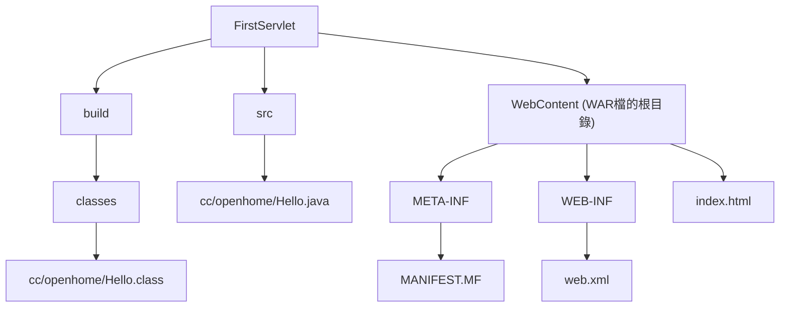
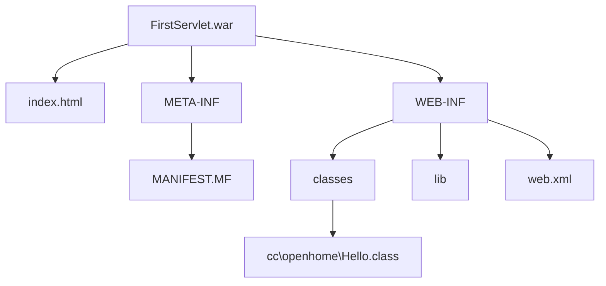
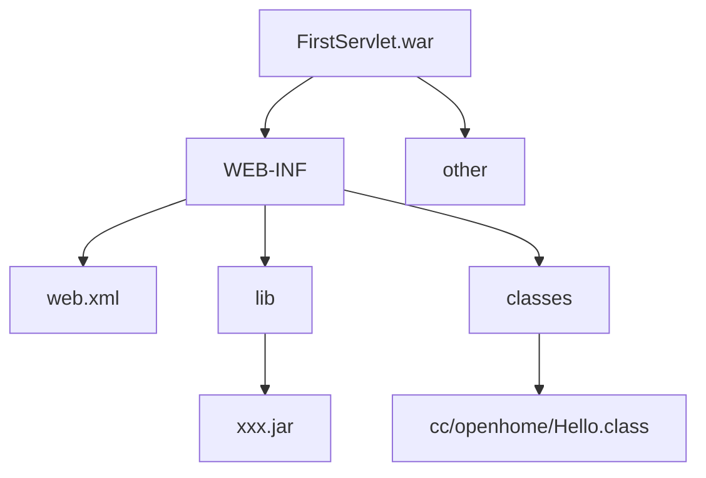
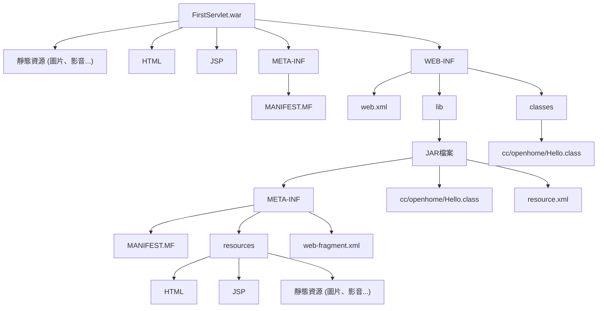
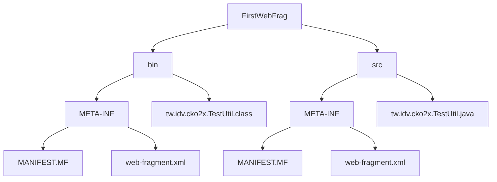

# Servlet&JSP技術手冊-邁向Spring Boot
###### tags: `書籍筆記`

---

## 第1章 簡介Web應用程式

### 1.1.4 HTTP請求方法《p.1-7》

| HTTP 方法 | 作用描述                                                   |
| --------- | ---------------------------------------------------------|
| GET       | 從服務器獲取資源或資源列表。                                  |
| POST      | 在服務器上創建新的資源。                                     |
| PUT       | 更新服務器上的現有資源。                                     |
| DELETE    | 從服務器上刪除現有的資源。                                   |
| HEAD      | 與 GET 請求類似，但只返回 HTTP 頭信息，不返回實際的資源內容。     |
| OPTIONS   | 獲取有關服務器支持哪些 HTTP 方法、哪些標頭字段等詳細信息。         |
| TRACE     | 用於將服務器收到的請求回映給客戶端，以幫助開發人員進行調試和故障排除。 |

```java=
String t1 = java.net.URLEncoder.encode("https://openhome.cc/林", "ISO-8859-1");
String t2 = java.net.URLDecoder.decode(t1, "ISO-8859-1");
out.println(t1);    // https%3A%2F%2Fopenhome.cc%2F%3F
out.println(t2);    // https://openhome.cc/?

// 中文字佔3Byte
String t3 = java.net.URLEncoder.encode("https://openhome.cc/林", "UTF-8");
String t4 = java.net.URLDecoder.decode(t3, "UTF-8");
out.println(t3);    // https%3A%2F%2Fopenhome.cc%2F%E6%9E%97
out.println(t4);    // https://openhome.cc/林

// 中文字佔2Byte
String t5 = java.net.URLEncoder.encode("https://openhome.cc/林", "BIG5");
String t6 = java.net.URLDecoder.decode(t5, "BIG5");		
out.println(t5);    // https%3A%2F%2Fopenhome.cc%2F%AA%4C
out.println(t6);    // https://openhome.cc/林
```

- [中英數在各編碼種類，所佔的位元組數](/v8M5BuhBQr2hiuNk8Adffg?both#getBytes)

|      | Unicode | UTF-8 | BIG5  | MS950 |
|------|---------|-------|-------|-------|
| 英數 | 4Byte   | 1Byte | 1Byte | 1Byte |
| 中文 | 4Byte   | 3Byte | 2Byte | 2Byte |

---

## 第2章 撰寫與設定Servlet

```java=
(itf) javax.servlet.Servlet
(itf) javax.servlet.ServletRequest
(itf) javax.servlet.ServletResponse
(itf) javax.servlet.ServletConfig
(itf) javax.servlet.ServletContext
(cls) javax.servlet.ServletException

(abs) javax.servlet.GenericServlet
(itf) javax.servlet.annotation.WebServlet

(abs) javax.servlet.http.HttpServlet
(itf) javax.servlet.http.HttpServletRequest
(itf) javax.servlet.http.HttpServletResponse

javax.servlet.http.HttpServlet (abstract)
	--(extends)--> javax.servlet.GenericServlet (abstract)
		--(implements)--> javax.servlet.Servlet (interface)
		--(implements)--> javax.servlet.ServletConfig (interface)

javax.servlet.http.HttpServletRequest (interface)
--(extends)--> javax.servlet.ServletRequest (interface)

javax.servlet.http.HttpServletResponse (interface)
--(extends)--> javax.servlet.ServletResponse (interface)
```

```java=

public interface java.servlet.Servlet {
    void init(ServletConfig config) throws ServletException;
    ServletConfig getServletConfig();
    String getServletInfo();
    void service(ServletRequest req, ServletResponse res) throws ServletException, IOException;
    void destroy();
}

public interface javax.servlet.ServletConfig {
    String getServletName();
    ServletContext getServletContext();
    String getInitParameter(String name);
    Enumeration<String> getInitParameterNames();
}

public abstract class GenericServlet implements Servlet, ServletConfig, java.io.Serializable {
	
    private transient ServletConfig config;
	
    @Override
    public void init(ServletConfig config) throws ServletException {
        this.config = config;
        this.init();
    }
	
    @Override
    public ServletConfig getServletConfig() {
        return config;
    }
	
    @Override
    public String getServletName() {
        return config.getServletName();
    }
	
    @Override
    public ServletContext getServletContext() {
        return getServletConfig().getServletContext();
    }	
	
    @Override
    public String getInitParameter(String name) {
        return getServletConfig().getInitParameter(name);
    }
	
    @Override
    public abstract void service(ServletRequest req, ServletResponse res) throws ServletException, IOException;
}

public abstract class javax.servlet.http.HttpServlet extends javax.servlet.GenericServlet
{
    protected void doGet(
    protected void doPost(
    protected void doHead(
    protected void doPut(
    protected void doDelete(
        javax.servlet.http.HttpServletRequest req, 
        javax.servlet.http.HttpServletResponse resp) 
        throws javax.servlet.ServletException, java.io.IOException {
    }
    
    @Override
    public void service(ServletRequest req, ServletResponse res) throws ServletException, IOException {

        HttpServletRequest request;
        HttpServletResponse response;

        try {
            request = (HttpServletRequest) req;
            response = (HttpServletResponse) res;
        } catch (ClassCastException e) {
            throw new ServletException(lStrings.getString("http.non_http"));
        }
        service(request, response);
    }
    
    protected void service(HttpServletRequest req, HttpServletResponse resp) throws ServletException, IOException {
        String method = req.getMethod();

        if (method.equals(METHOD_GET)) {
            doGet(req, resp);
        } else if (method.equals(METHOD_HEAD)) {		
            doHead(req, resp);
        } else if (method.equals(METHOD_POST)) {
            doPost(req, resp);
        } else if (method.equals(METHOD_PUT)) {
            doPut(req, resp);
        } else if (method.equals(METHOD_DELETE)) {
            doDelete(req, resp);
        } else if (method.equals(METHOD_OPTIONS)) {
            doOptions(req, resp);
        } else if (method.equals(METHOD_TRACE)) {
            doTrace(req, resp);
        } else {
            //....
        }
    }
}
```

```java=
public class java.io.PrintWriter extends java.io.Writer(抽象類別) {	
}

public interface javax.servlet.ServletResponse {
    java.io.PrintWriter getWriter() throws java.io.IOException;
}

// reponse
public interface javax.servlet.http.HttpServletResponse extends javax.servlet.ServletResponse {
}

Container 收集HTTP請求的資訊，並實作 HttpServletResponse 介面及建立物件，且實作 getWriter()
java.io.PrintWriter out = response.getWriter();

javax.servlet.http.HttpServletResponse (interface)
--(extends)--> javax.servlet.ServletResponse (interface)
```

```java=
public interface javax.servlet.ServletRequest {
    String getParameter(String name);
}

public interface java.servlet.http.HttpServletRequest extends javax.servlet.ServletRequest {
    String getMethod();
}

Container 收集HTTP請求的資訊，並實作 HttpServletRequest 介面及建立物件，且實作 getParameter()
String name = request.getParameter("name");

javax.servlet.http.HttpServletRequest (interface)
--(extends)--> javax.servlet.ServletRequest (interface)
```

### 2.2.1 關於 HttpServlet《p.2-8》

```java!
C:\workspace\FirstServlet>javac src/cc/openhome/Hello.java -d ./build/classes -classpath ..\apache-tomcat-9.0.75\lib\servlet-api.jar
```

&nbsp;
// ================================================== //






### 2.2.2 使用@WebServlet《p.2-10》

```java=
@WebServlet("/hello")

等於

@WebServlet(name="cc.openhome.Hello",	// 預設值是 Servlet 的類別完整名稱
	urlPatterns={"/hello"},
	loadOnStartup=-1	// 預設值 -1
)
```

### 2.2.4 檔案組織與部署《p.2-15》



### 2.3.1 URI模式設定《p.2-17》

```haskell=
EXACT Mapping > Path Mapping(/guest/*) > Path Mapping(/*) > Extension Mapping > Default Mapping
Context Root
```

```haskell
【嚴格匹配 (Exact Mapping)】
==> /guest/test.view
進行路徑的嚴格對應
PathInfo 為 null


【路徑對應 (Path Mapping)】
==> url_pattern：/guest/*
以/guest/為開頭
*為PathInfo


【N/A (Path Mapping)】
==> url_pattern：/*
/FirstServlet/ab/cd 中的 /ab/cd，會認定為 PathInfo
ServletPath 為空字串 
*為PathInfo


【延伸對應 (Extension Mapping)】
==> url_pattern：*.extension
以*.為開頭
PathInfo 為 null


【預設Servlet (Default Mapping)】
==> url_pattern：/
當找不到適合的URI模式對應，就會使用預設 Servlet
PathInfo 為 null


【環境根資料夾對應(Context root)】
==> url_pattern：""
http://host:port/app/
ServletPath 為空字串 
PathInfo 為 /

```

:::spoiler
### **url-pattern：/guest/exact.ct**

```haskell
http://localhost:8080/FirstServlet/guest/exact.ct?age=40 
servlet-name：Hello.ano 
url-pattern：/guest/exact.ct 

ServletName：Hello.ano 
RequestURI：/FirstServlet/guest/exact.ct 
ContextPath：/FirstServlet 
ServletPath：/guest/exact.ct 
PathInfo：null 
Parameters：age=40  
```
:::

:::spoiler
### **url_pattern：/guest/***

```haskell
http://localhost:8080/FirstServlet/hello6/aa/bb.view?age=12 
servlet-name：Hello.ano 
url-pattern：/hello6/* 

ServletName：Hello.ano 
RequestURI：/FirstServlet/hello6/aa/bb.view 
ContextPath：/FirstServlet 
ServletPath：/hello6 
PathInfo：/aa/bb.view 
Parameters：age=12 
```

```haskell
http://localhost:8080/FirstServlet/hello6 
servlet-name：Hello.ano 
url-pattern：/hello6/* 

ServletName：Hello.ano 
RequestURI：/FirstServlet/hello6 
ContextPath：/FirstServlet 
ServletPath：/hello6 
PathInfo：null 
Parameters：null
```
:::

:::spoiler
### **url_pattern：/***

```haskell
// 若無設定此 url-pattern，則容器會判定此 URI 為「預設 Servlet」或 Error Page
------------------------------------------------------------
http://localhost:8080/FirstServlet/ab/cd 
servlet-name：Hello.ano 
url-pattern：/* 

ServletName：Hello.ano 
RequestURI：/FirstServlet/ab/cd 
ContextPath：/FirstServlet 
ServletPath： 
PathInfo：/ab/cd 
Parameters：null
```
:::

:::spoiler
### **url_pattern：*.extension**

```haskell
http://localhost:8080/FirstServlet/helloUser.del 
servlet-name：Hello.ano 
url-pattern：*.del 

ServletName：Hello.ano 
RequestURI：/FirstServlet/helloUser.del 
ContextPath：/FirstServlet 
ServletPath：/helloUser.del 
PathInfo：null 
Parameters：null 
```

```haskell
http://localhost:8080/FirstServlet/guest/my.py?age=40 
servlet-name：Hello.ano 
url-pattern：*.py 

ServletName：Hello.ano 
RequestURI：/FirstServlet/guest/my.py 
ContextPath：/FirstServlet 
ServletPath：/guest/my.py 
PathInfo：null 
Parameters：age=40 
```

```haskell
http://localhost:8080/FirstServlet/helloUser.del/dd/ee 
servlet-name：Hello.def 
url-pattern：/ 

ServletName：Hello.def 
RequestURI：/FirstServlet/helloUser.del/dd/ee 
ContextPath：/FirstServlet 
ServletPath：/helloUser.del/dd/ee 
PathInfo：null 
Parameters：null
```
:::

:::spoiler
### **url_pattern：/**

```haskell
http://localhost:8080/FirstServlet/helloUser.del/ee/ff 
servlet-name：Hello.def 
url-pattern：/ 

ServletName：Hello.def 
RequestURI：/FirstServlet/helloUser.del/ee/ff 
ContextPath：/FirstServlet 
ServletPath：/helloUser.del/ee/ff 
PathInfo：null 
Parameters：null 
```
:::

:::spoiler
### **url_pattern：空字串**

```haskell
// 若無設定此 url-pattern，則容器會判定此 URI 為「預設 Servlet」或 Error Page
------------------------------------------------------------
http://localhost:8080/FirstServlet/?age=16 
servlet-name：Hello.ano 
url-pattern： 

ServletName：Hello.ano 
RequestURI：/FirstServlet/ 
ContextPath：/FirstServlet 
ServletPath： 
PathInfo：/ 
Parameters：age=16 
```
:::

<br><br>

```haskell=
url-pattern：*            // 編譯錯誤
url-pattern：aa*          // 編譯錯誤
url-pattern：aa.*         // 編譯錯誤
url-pattern：/*.vi        // 編譯錯誤
url-pattern：/cc/*.vi     // 編譯錯誤
url-pattern：/cc.*        // 判定為「預設 Servlet」 或 Error Page
url-pattern：/cc*         // 判定為「預設 Servlet」 或 Error Page
```

```java=
http://localhost:8080/FirstServlet/helloUser?age=16 	// request.getRequestURL() + request.getQueryString()
servlet-name：Hello.xml    // request.getHttpServletMapping().getServletName()
url-pattern：/helloUser    // request.getHttpServletMapping().getPattern()

ServletName：Hello.xml                // request.getHttpServletMapping().getServletName()
RequestURI：/FirstServlet/helloUser   // request.getRequestURI()
ContextPath：/FirstServlet            // request.getContextPath()
ServletPath：/helloUser               // request.getServletPath()
PathInfo：null                        // request.getPathInfo()
Parameters：age=16                    // request.getQueryString()
```

**測試程式碼**
```java=
@WebServlet(name = "Hello.ano", urlPatterns = { "/guest/exact.ct", "/hello6/*", "/*", "*.py", "/", "" })

protected void doGet(HttpServletRequest request, HttpServletResponse response)
			throws ServletException, IOException {

    response.setContentType("text/html;charset=UTF-8");
    String qryString = request.getQueryString();

    java.io.PrintWriter out = response.getWriter();
    out.print("<!DOCTYPE html>");
    out.print("<html>");
    out.print("<head>");
    out.print("<title>Hello</title>");
    out.print("</head>");
    out.print("<body>");

    out.printf("%s%s <br>", request.getRequestURL(), qryString != null ? "?" + qryString : "");
    out.printf("servlet-name：%s <br>", request.getHttpServletMapping().getServletName());
    out.printf("url-pattern：%s <br>", request.getHttpServletMapping().getPattern());
    out.print("<br>");
    out.printf("ServletName：%s <br>", request.getHttpServletMapping().getServletName());
    out.printf("RequestURI：%s <br>", request.getRequestURI());
    out.printf("ContextPath：%s <br>", request.getContextPath());
    out.printf("ServletPath：%s <br>", request.getServletPath());
    out.printf("PathInfo：%s <br>", request.getPathInfo());
    out.printf("Parameters：%s <br>", qryString);

    out.print("========================================================== <br>");
    out.printf("MappingMatch：%s <br>", request.getHttpServletMapping().getMappingMatch());
    out.printf("getMatchValue：%s <br>", request.getHttpServletMapping().getMatchValue());

    out.print("</body>");
    out.print("</html>");
    }
```

### *- javax.servlet.http.HttpServletRequest.HttpServletMapping《 p2-20》*

```haskell
http://localhost:8080/FirstServlet/guest/exact.ct
url-pattern：/guest/exact.ct 
MappingMatch：EXACT 
MatchValue：guest/exact.ct 


http://localhost:8080/FirstServlet/hello6/myPage.py
url-pattern：/hello6/*
MappingMatch：PATH 
MatchValue：myPage.py


http://localhost:8080/FirstServlet/mypage.py
url-pattern：/* 
MappingMatch：PATH 
MatchValue：mypage.py 
(因為在順序上，Path Mapping (包含/*) > Extension Mapping )


http://localhost:8080/FirstServlet/guest/my.py?age=40 
url-pattern：*.py 
MappingMatch：EXTENSION 
MatchValue：guest/my


http://localhost:8080/FirstServlet/tryDefault
url-pattern：/
MappingMatch：DEFAULT 
MatchValue：


http://localhost:8080/FirstServlet/
url-pattern：
MappingMatch：CONTEXT_ROOT 
MatchValue： 
```

```java=
javax.servlet.http.HttpServletRequest request;
java.lang.StringBuffer sbf = request.getRequestURL();
String uri = request.getRequestURI();
String cp = request.getContextPath();
String sp = request.getServletPath();
String pi = request.getPathInfo();
String qs = request.getQueryString();

javax.servlet.http.HttpServletMapping mapping = request.getHttpServletMapping()
javax.servlet.http.MappingMatch match = mapping.getMappingMatch();
String dd = mapping.getMatchValue()
String sn = mapping.getServletName();
String pn = mapping.getPattern();
```

### 2.3.2 Web資料夾結構《p.2-21》



### 2.3.3 使用 web-fragment.xml《p.2-23》



## 第3章 請求與回應

### 3.1.2 doXXX()方法?《p.3-4》

- [HttpServlet類源碼的getLastModified()返回值為什麼是-1?](https://blog.csdn.net/qq_29951485/article/details/88981624)
- [為什麼HttpServlet的getLastModified返回的是-1？](https://segmentfault.com/q/1010000006089637)
- [servlet 中getLastModified()](https://blog.csdn.net/liu78778/article/details/5561871)

```java=
(a) (HttpServlet) getLastModified()：伺服器文件的最後更新時間(距離1970/1/1的毫秒差)
(b) (Browswer Request Header) if-Modified-Since：瀏覽器最後收到文件的時間
(c) (Server Response Header) Last-Modified：伺服器文件的最後更新時間

1. 如果(a)為負數 (不支持緩存機制)
 => 直接執行 doGet()、Status Code 200、不會生成(b)及(c)

2. 如果(a)為正數，request Header 沒帶 (b) (可以想成是第一次請求為0)
3. 如果(a)為正數，request Header 有帶 (b)，並且(a) > (b) 
 => 執行 doGet()、reponse Header 生成 (c)、Status Code 200

4. 如果(a)為正數，request Header 有帶 (b)，並且(a) < (b)
 => 不執行doGet()、Status Code 304
```

```java=
public abstract class java.servlet.http.HttpServlet extends javax.servlet.GenericServlet {
    protected long getLastModified(javax.servlet.http.HttpServletRequest req) {
        return -1;
    }
}
```

```java=
@WebServlet(name = "Hello.ano", urlPatterns = { "/guest/exact.ct", "/hello6/*", "/*", "*.py", "/", "" })
public class Hello extends javax.servlet.http.HttpServlet {
    @Override
    protected long getLastModified(javax.servlet.http.HttpServletRequest req){
        return 5000;
    }	
}
```


