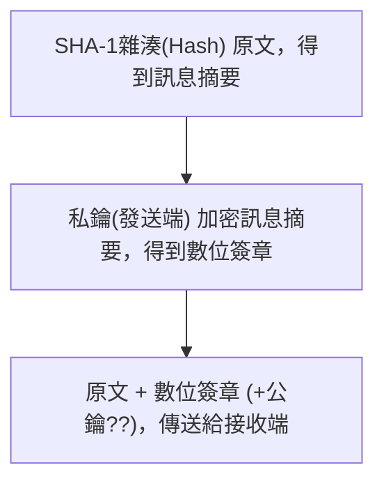
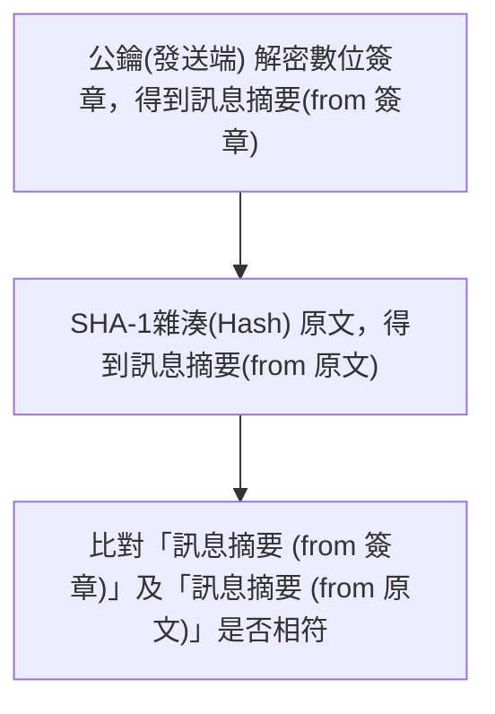

# MIS
###### tags: `技術文件`


---
## Singles
- [從傳紙條輕鬆學習基本網路概念](https://hulitw.medium.com/learning-tcp-ip-http-via-sending-letter-5d3299203660)
- [網路通訊輕鬆聊系列](https://ithelp.ithome.com.tw/users/20128159/ironman/4321)

---
## Virtual Box
- [[Tool] VirtualBox 網路卡種類](https://zwindr.blogspot.com/2016/11/tool-virtualbox.html)
- [第2章：實驗操作的環境之虛擬機器介紹](https://ithelp.ithome.com.tw/articles/10267009?sc=rss.iron)
- [解決ping不到Windows 10 方法](https://benson82208.pixnet.net/blog/post/43829710-%E8%A7%A3%E6%B1%BAping%E4%B8%8D%E5%88%B0windows-10-%E6%96%B9%E6%B3%95)
- [如何讓使用VirtualBox,讓Host OS可以Ping到Guest OS(Windows 2008 R2)](https://infotecresearch.blogspot.com/2013/03/virtualboxhost-ospingguest-oswindows.html)
- [橋接網路，讓 VM 與 host 在同一虛擬網段並可連外，互相存取彼此服務。](https://blog.camel2243.com/2016/09/29/virtualbox-%E6%A9%8B%E6%8E%A5%E7%B6%B2%E8%B7%AF%EF%BC%8C%E8%AE%93-vm-%E8%88%87-host-%E5%9C%A8%E5%90%8C%E4%B8%80%E8%99%9B%E6%93%AC%E7%B6%B2%E6%AE%B5%E4%B8%A6%E5%8F%AF%E9%80%A3%E5%A4%96%EF%BC%8C/)


---
## 正向代理(Forward Proxy)、反向代理(Reserve Proxy)
- [用人類語言跟你說甚麼是正向代理(Forward Proxy)和反向代理(Reverse Proxy)](https://www.pressplay.cc/project/F720CEB1D6057D7ABB5614722AB18FFF/articles/660A57208C29FF94453548ED21F284EF)
- [CDN教學：解析反向代理伺服器原理與優勢，一次帶你了解](https://www.apeiro8.com/how-does-reverse-proxy-work-in-cdn/)
- [終於有人把正向代理和反向代理解釋的明明白白了](https://kknews.cc/zh-tw/tech/k66p2gb.html)


---
## 集線器(Hub)、交換器(Switch)、路由器(Router)、IP分享器
- [集線器(Hub)、交換器(Switch)、IP分享器、路由器(Router)的差別](https://getpocket.com/read/3718187221)
- [集線器(Hub)、交換器(Switch)、IP分享器、路由器(Router)的差別_Link2](https://walterwu-22843.medium.com/internet-%E9%9B%86%E7%B7%9A%E5%99%A8-hub-%E4%BA%A4%E6%8F%9B%E5%99%A8-switch-ip%E5%88%86%E4%BA%AB%E5%99%A8-%E8%B7%AF%E7%94%B1%E5%99%A8-router-%E7%9A%84%E5%B7%AE%E5%88%A5-8bc83c503a08)
- [[俋安網路設備小教室]路由器 (Router) vs 數據機 (Modem) vs 網路交換器 (Switch) vs 網路集線器 (Hub) 傻傻分不清楚?!](https://getpocket.com/read/3718247553)
- [[網路小知識]網路設備Hub、Switch和Router的差異](https://getpocket.com/read/3718247696)
- [網路基礎知識 - 路由器(Router)、交換器(Switch)、集線器(Hub)的分別](https://getpocket.com/read/3718248374)

:::info
==封包內含目的及來源的 「IP、MAC」==
1. Hub => 廣播式傳輸 / 半雙工，不能同時「發、送」資料
1. Switch => 區隔 Mac 位址，並準確傳送封包 / 全雙工，可以同時「發、送」資料
1. Router => 兩個 IP Domain 介面 / 連接不同的網路
1. IP分享器 => 有 NAT 功能 / 兩個 IP Domain 介面為「Wan Port、Lan Port」
:::


---
## Windows Event Viewer 事件檢視器
- [如何在 Windows 事件檢視器中建立開關機時間紀錄？ | 就是教不落 - 給你最豐富的 3C 資訊、教學網站](https://steachs.com/archives/27773)
- [如何用事件檢視器的事件ID(Event ID)找問題的答案 @ jeffyeh :: 痞客邦 :: ](http://jeffyeh.pixnet.net/blog/post/41719277?utm_source=pocket_mylist)


---
## Batch
- [Windows xcopy](http://jdev.tw/blog/4334/xcopy-with-echo)
- [如何在 Bat 檔案中睡眠或等待 X 秒](https://www.delftstack.com/zh-tw/howto/batch/how-to-sleep-or-wait-x-seconds-in-a-bat-file/)
- [如何在 Bat 檔案中關閉、重啟或者登出電腦](https://www.delftstack.com/zh-tw/howto/batch/how-to-shutdown-restart-and-or-log-off-in-a-bat-file/)
- [批處理指令碼中的 PAUSE 關鍵字](https://www.delftstack.com/zh-tw/howto/batch/batch-file-pause/)


---
## 簽章
### 1. 軟體簽章
- [[Code Signing] 淺談 Code Signing 程式碼簽章](https://dotblogs.com.tw/mystic_pieces/2018/05/13/024544)
- [[Code Signing] 淺談 EV Code Signing 延伸驗證程式碼簽章](https://dotblogs.com.tw/Mystic_Pieces/2018/05/18/003107)
- [[Code Signing] 利用自然人憑證進行程式碼簽章](https://dotblogs.com.tw/Mystic_Pieces/2018/06/03/150349)
- [如何刪除安裝在電腦中的管理憑證](https://dotblogs.com.tw/terrychuang/2013/08/31/116020)
- [Windows 以 PowerShell 建立程式碼簽章用的自簽憑證教學與範例](https://officeguide.cc/windows-generate-self-signed-certificate-for-code-signing-tutorial-examples/)

### 2. 數位簽章 (digital signature)

- [.NET 非對稱式加密與數位簽章程式設計入門](https://www.huanlintalk.com/2008/04/dotnet-encryption.html)

:::info
:bulb: **注意!!**
1. 私密金鑰必須妥善保存，絕不可外洩；公開金鑰可對外公開，任何人都能取得。
1. 使用公開金鑰加密的資料只有對應的私鑰可解，使用私密金鑰加密的資料只有對應的公開金鑰能解。
1. 雜湊演算法(Hashing algorithm/SHA-1) 無法還原訊息。
:::

::::success

:::info
:point_right: 公私鑰加密
1. ==(接收者產生公私鑰)== 公鑰加密資料 --> 私鑰解密資料 <<== 防止資料被他人窺視(他人無法解密)。但無法驗證不可否認性(駭客可以偽造資料)。
1. ==(傳送者產生公私鑰)== 私鑰加密資料 --> 公鑰解密資料 <<== 資料會被他人窺視(會被用公鑰解密)。若公鑰無法解密，代表資料被竄改過。可驗證不可否認性。
2. 以收件者的公鑰加密，使其他人無法取得其內容，則稱為數位信封。
:::

:::info
<i class="fa fa-file-text"> 數位簽章流程</i>
+ 數位簽章 <= 判斷訊息是否遭到篡改 ==(跟私鑰加密同)==

#### 發送端


#### 接收端


:extract_focal()/http%3A%2F%2F2.bp.blogspot.com%2F-3ehq4LRgKxY%2FWPyCWAB74AI%2FAAAAAAAAB-c%2F1nQF61h_uMcihHU7bLEBAq65pWlS0MfTwCK4B%2Fs1600%2F%2525E5%25259C%252596%2525E7%252589%2525871.png)

:::

:::info
:thumbsup: 嚴謹的做法 ( Alice --> Bob )

1. 用公鑰(Bob 所產生) 加密原文
2. SHA-1雜湊原文 => 訊息摘要；用私鑰(Alice 所產生) 加密訊息摘要 => 數位簽章
3. 加密原文(第1點) + 數位簽章(第2點)，傳送給接收端


:::

::::

:::info
:bulb: **注意-2!!**
1. ==比較兩個雜湊值(原文、簽章)==，如果相同的話，則可以確定該訊息的『完整性』；此外也可以確定其『不可否認性』（==私有鑰匙與公開鑰匙配對==）。
2. 「RSA數位簽章」可選擇不同的雜湊演算法來實現，譬如 MD4、MD5 或 SHA-1。將訊息經過雜湊函數計算後，再經過 RSA 演算法加密（私有鑰匙），便可得到數位簽章的簽署碼。
3. RSA、DSA 演算法一樣，應付暴力破解，即是增加「鑰匙的長度」或「增加簽署碼」的長度。一般情況，使用期間較短的簽署，大多使用 ==1024位元== 長度即可；但對於使用期間較長的簽署，可需要 ==2048位元== 以上才算安全。
4. 實際操作時請必須把金鑰儲存在憑證中。
:::

:::info
<i class="fa fa-file-text"> 雜湊 Hash</i>
+ 單向 (由雜湊值是==無法反推出原來的訊息==)
+ 無論原文的內容長短，透過雜湊演算法運算完的輸出都會是==固定的長度==
+ 兩個原文的內容即便只差一個字，雜湊演算法產生的兩個輸出內容，卻會差非常多 (Avalanche effect)
+ 好的雜湊函式在輸入域中很少出現雜湊碰撞（collision）
+ 常見的雜湊函數 md5, sha256
:::

```javascript
．雜湊演算法（hashing algorithm，如：MD5、SHA-1、SHA256）
．對稱式加密（如：DES、AES）
．非對稱式加密（如：RSA 演算法）(公私鑰)
```

- [第七章 數位簽章與數位憑證](http://www.tsnien.idv.tw/Security_WebBook/%E7%AC%AC%E4%B8%83%E7%AB%A0%20%E6%95%B8%E4%BD%8D%E7%B0%BD%E7%AB%A0%E8%88%87%E6%95%B8%E4%BD%8D%E6%86%91%E8%AD%89.html)
- [密碼學(三):數位簽章](https://justreadwithme.medium.com/%E5%AF%86%E7%A2%BC%E5%AD%B8-%E4%B8%89-%E6%95%B8%E4%BD%8D%E7%B0%BD%E7%AB%A0-f8c6a78da46b)
- [[Day21] 資料傳輸安全(完整性)數位簽章](https://ithelp.ithome.com.tw/articles/10188465)
- [★★ 瞭解公開金鑰加密(公開金鑰加密與郵件加密)](https://docs.microsoft.com/zh-tw/previous-versions/exchange-server/exchange-server-2000//aa998077(v=exchg.65)?redirectedfrom=MSDN#%E5%85%AC%E9%96%8B%E9%87%91%E9%91%B0%E5%8A%A0%E5%AF%86%E7%9A%84%E9%81%8B%E4%BD%9C%E6%96%B9%E5%BC%8F)
- [三分鐘讀懂 Encode 編碼、Encrypt 加密、Hash 雜湊](https://nullpointerexception.tangblack.com/encode-%E7%B7%A8%E7%A2%BC%E3%80%81encrypt-%E5%8A%A0%E5%AF%86%E3%80%81hash-%E9%9B%9C%E6%B9%8A/)

---
## 數位憑證

:point_right: :book: [**數位憑證筆記.docx**](https://cko2xt-zoho.quip.com/-/blob/AbaAAAK9w87/2hlSIIMIkK1PK9AhdDqlgw?name=%E6%95%B8%E4%BD%8D%E6%86%91%E8%AD%89%E7%AD%86%E8%A8%98.docx)

:::info
:point_right: **數位憑證是什麼？**
+ 數位憑證是一份電子性的文件，被用來證明持有人的身分證明。
+ 我們希望在 Internet 網路的虛擬環境下，也能接近於實體環境。在實體環境，當您在高速公路上駕駛汽車，遇到警察檢查您的駕照時，您只要亮出您的駕照即可，至於您的駕照是真是假？這可要警察自己去判斷。至於警察如何判斷汽車駕照的真假？除了這個駕照是政府（權威單位）所發外，在駕照上必須有政府單位的戳記，方便警察人員辨識。倘若這樣還是無法嚇止他人使用假駕照的話，警察人員可以透過網路向電腦查詢，這個駕照的來源、以及使用期限，使造假者無法遁形。
+ 數位憑證則可以想像成==公鑰的保證書==，以驗證拿到的公鑰真的是某人的公鑰。
+ 「數位憑證」通常包括==持有者==的「名稱、組織、國家、Email、公開鑰匙 等...」，還有「CA名稱、CA證明限期、CA的數位簽章」。
+ 發送者將「原文、數位簽章、發送者公鑰、數位憑證」一併傳送給接收者。
:::

- [第七章 數位簽章與數位憑證](http://www.tsnien.idv.tw/Security_WebBook/%E7%AC%AC%E4%B8%83%E7%AB%A0%20%E6%95%B8%E4%BD%8D%E7%B0%BD%E7%AB%A0%E8%88%87%E6%95%B8%E4%BD%8D%E6%86%91%E8%AD%89.html)
- [密碼學(三):數位簽章](https://justreadwithme.medium.com/%E5%AF%86%E7%A2%BC%E5%AD%B8-%E4%B8%89-%E6%95%B8%E4%BD%8D%E7%B0%BD%E7%AB%A0-f8c6a78da46b)
- [數位簽章、數位信封、數位憑證](https://getpocket.com/read/2597552140)
- [認識 PKI 架構下的數位憑證格式與憑證格式轉換的心得分享](https://blog.miniasp.com/post/2018/04/21/PKI-Digital-Certificate-Format-Convertion-Notes)

---
## 公開金鑰基礎建設（Public Key Infrastructure / PKI）
### 1. OCSP && CRL
- [線上憑證狀態協定（Online Certificate Status Protocol, OCSP）](http://www.myhome.net.tw/2017_04/p04.htm)

### 2. 憑證註冊中心（RA）
- [憑證註冊中心（RA）是什麼](https://marketing.ares.com.tw/newsletter/2012-11/ra)

### 3. HSM (Hardware security module)
- [HSM是什麼意思？HSM是什麼的縮寫？](https://getpocket.com/read/3704841693)